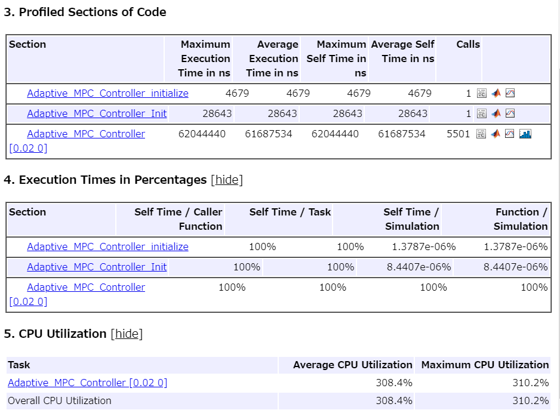
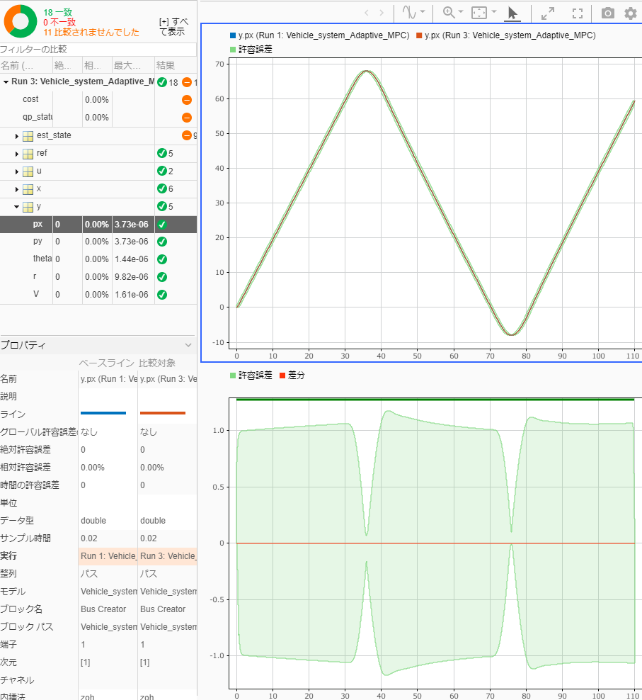

# 適応MPCコントローラの設計と実装

このサンプルでは、適応MPCを設計するブロック"Adaptive MPC Controller"を用いた設計の例を示す。


また、設計後のCコード生成、SIL、PILの例も合わせて紹介する。

# 初期化
```matlab
clc; Simulink.sdi.clear; Simulink.sdi.clearPreferences; Simulink.sdi.close;
proj = currentProject;
create_ref_data;
model_name = 'Vehicle_system_Adaptive_MPC';
ada_controller_name = 'Adaptive_MPC_Controller';
ts = get_TimeStep('sim_data_vehicle.sldd');

```
# プラントモデルを定式化

4輪の前輪操舵車両を考える。等価二輪モデルで近似する（図1）。


図1. 等価二輪モデル


ここで、等価二輪モデルの数式を元にプラントモデリングとMPCの定式化を行っていく。このモデルにおいては、以下の式eq_1, eq_2が成り立つ。

```matlab
% 変数定義
syms m u v r F_f F_r real;
syms I l_f l_r v_dot r_dot V beta beta_dot real;
% 方程式
eq_1 = m * (v_dot + u * r) == F_f + F_r
```
eq_1 = 
 $\displaystyle m\,{\left(\dot{v} +r\,u\right)}=F_f +F_r $
 

```matlab
eq_2 = I * r_dot == l_f * F_f - l_r * F_r
```
eq_2 = 
 $\displaystyle \textrm{I}\,\dot{r} =F_f \,l_f -F_r \,l_r $
 

ここで、 $v$ は横速度、 $r$ は車のヨーレート（z軸方向の回転角速度）である。 $\dot{v}$ と $\dot{r}$ はそれぞれ $v$ と $r$ の時間微分を表す。 $F_f$ と $F_r$ は前後のタイヤから発生する横向きの力を表す。


車体の横滑り角 $\beta \;$ が小さい範囲の運動を考えることにすると、次のような関係が成り立つ。


 $u\cong V$ , $v=\textrm{Vsin}\beta \cong V\beta \;$ 


速度を一定と仮定すると、 $\dot{v}$ は以下のようになる。

 $$ \dot{v} =V\dot{\beta} \; $$ 

これらの関係を用いると、eq_1は、以下のように書き直すことができる。

```matlab
% 代入
eq_1 = subs(eq_1, [u, v_dot], [V, V * beta_dot])
```
eq_1 = 
 $\displaystyle m\,{\left(V\,\dot{\beta} +V\,r\right)}=F_f +F_r $
 

前後のタイヤの横滑り角を $\beta_f$ 、 $\beta_r$ とすると、横力は


 $F_f =-2K_f \beta_f$ ,  $F_r =-2K_r \beta {\;}_r$ 


となる。


また、 $\beta_f$ と $\beta_r$ は近似的に次のように表すことができる。


 $\beta_f =\beta +\frac{l_f }{V}r-\delta$ ,  $\beta_r =\beta -\frac{l_r }{V}r$ 


 $\delta$ は操舵角である。


eq_1、eq_2に上記の式を代入すると、以下のようになる。

```matlab
% 変数定義
syms K_f K_r delta beta_f beta_r real;
% 代入
eq_vec = subs([eq_1, eq_2], [F_f, F_r], [-2 * K_f * beta_f, -2 * K_r * beta_r]);
eq_vec = subs(eq_vec, [beta_f, beta_r], ...
              [beta + (l_f / V) * r - delta, beta - (l_r / V) * r]);
eq_1 = eq_vec(1)
```
eq_1 = 
 $\displaystyle m\,{\left(V\,\dot{\beta} +V\,r\right)}=-2\,K_f \,{\left(\beta -\delta +\frac{l_f \,r}{V}\right)}-2\,K_r \,{\left(\beta -\frac{l_r \,r}{V}\right)}$
 

```matlab
eq_2 = eq_vec(2)
```
eq_2 = 
 $\displaystyle \textrm{I}\,\dot{r} =2\,K_r \,l_r \,{\left(\beta -\frac{l_r \,r}{V}\right)}-2\,K_f \,l_f \,{\left(\beta -\delta +\frac{l_f \,r}{V}\right)}$
 

 $\dot{\beta}$ と $\dot{r}$ を求める計算式を導出する。

```matlab
sol_vec = solve([eq_1, eq_2], [beta_dot, r_dot]);
beta_dot = sol_vec.beta_dot
```
beta_dot = 
 $\displaystyle -\frac{2\,K_f \,V\,\beta +2\,K_r \,V\,\beta -2\,K_f \,V\,\delta +2\,K_f \,l_f \,r-2\,K_r \,l_r \,r+V^2 \,m\,r}{V^2 \,m}$
 

```matlab
r_dot = sol_vec.r_dot
```
r_dot = 
 $\displaystyle -\frac{2\,{\left(K_f \,{l_f }^2 \,r+K_r \,{l_r }^2 \,r+K_f \,V\,\beta \,l_f -K_r \,V\,\beta \,l_r -K_f \,V\,\delta \,l_f \right)}}{\textrm{I}\,V}$
 

 $\beta$ と $r$ は、 $\dot{\beta}$ と $\dot{r}$ を時間積分することで得られる。

# 状態空間表現

車両の運動を状態空間表現に置き換える。


[入力U]


操舵角 $\delta$ 、車両加速度 $a$ 

```matlab
normal_input_names = {'delta', 'a'};
% 変数定義
syms a real;
U = [delta; a];
```

[状態x]


車両の速さ $V$ 、横滑り角 $\beta$ 、ヨーレート $r$ 、ヨー角 $\theta$ 、X方向位置 $p_x$ 、Y方向位置 $p_y$ 

```matlab
state_names = {'px', 'py', 'theta', 'r', 'beta', 'V'};
% 変数定義
syms theta px py real;
X = [px; py; theta; r; beta; V];
```

[出力y]


車両の速さ $V$ 、ヨーレート $r$ 、ヨー角 $\theta$ 、X方向位置 $p_x$ 、Y方向位置 $p_y$ 

```matlab
output_names = {'px', 'py', 'theta', 'r', 'V'};
Y = [px; py; theta; r; V];
```


連続非線形の状態方程式 $\dot{X} =f\left(X,U\right)$ の $f$ を作る。

 $$ \dot{x} =\textrm{Vsin}\theta $$ 

 $$ \dot{y} =\textrm{Vcos}\theta \; $$ 

 $$ \dot{\theta} =r $$ 

 $\dot{r} =$ sol_vec.r_dot


 $\dot{\beta} =$ sol_vec.beta_dot

 $$ \dot{V} =a $$ 

よって、

```matlab
f = [ ...
    V * cos(theta);
    V * sin(theta);
    r;
    sol_vec.r_dot;
    sol_vec.beta_dot;
    a;
     ]
```
f = 
 $\displaystyle \left(\begin{array}{c} V\,\cos \left(\theta \right)\\ V\,\sin \left(\theta \right)\\ r\\ -\frac{2\,{\left(K_f \,{l_f }^2 \,r+K_r \,{l_r }^2 \,r+K_f \,V\,\beta \,l_f -K_r \,V\,\beta \,l_r -K_f \,V\,\delta \,l_f \right)}}{\textrm{I}\,V}\\ -\frac{2\,K_f \,V\,\beta +2\,K_r \,V\,\beta -2\,K_f \,V\,\delta +2\,K_f \,l_f \,r-2\,K_r \,l_r \,r+V^2 \,m\,r}{V^2 \,m}\\ a \end{array}\right)$
 

出力方程式 $Y=h\left(X\right)$ の $h$ は以下のようになる。

```matlab
 h = [X(1); X(2); X(3); X(4); X(6)]
```
h = 
 $\displaystyle \left(\begin{array}{c} \textrm{px}\\ \textrm{py}\\ \theta \\ r\\ V \end{array}\right)$
 

得られた計算式をMATLABコード生成する。


ただし、そのままコード生成すると、割り算の箇所はゼロ割を回避できていない。そこで、生成されたコードを上書きして自動でゼロ割回避を挿入する関数を用意した。


以下のようにその関数を適用する。適用後の関数は(元々のファイル名) + '_azd'という名前となる。

```matlab
file_path = [char(proj.RootFolder), filesep, 'gen_script', filesep, 'calc_nonlinear_f.m'];
matlabFunction(f, 'File', file_path);
insert_zero_divide_avoidance(file_path);
file_path = [char(proj.RootFolder), filesep, 'gen_script', filesep, 'calc_nonlinear_h.m'];
matlabFunction(h, 'File', file_path);
insert_zero_divide_avoidance(file_path);
```
# MPCのための定式化

Adaptive MPCは、非線形モデルを逐次線形化してモデル予測制御を行っている。そこで、fとhを線形化したA、B、C行列が必要である。

```matlab
Ac = jacobian(f, X)
```
Ac = 
 $\displaystyle \left(\begin{array}{cccccc} 0 & 0 & -V\,\sin \left(\theta \right) & 0 & 0 & \cos \left(\theta \right)\\ 0 & 0 & V\,\cos \left(\theta \right) & 0 & 0 & \sin \left(\theta \right)\\ 0 & 0 & 0 & 1 & 0 & 0\\ 0 & 0 & 0 & -\frac{2\,{\left(K_f \,{l_f }^2 +K_r \,{l_r }^2 \right)}}{\textrm{I}\,V} & -\frac{2\,{\left(K_f \,V\,l_f -K_r \,V\,l_r \right)}}{\textrm{I}\,V} & \frac{2\,{\left(K_f \,{l_f }^2 \,r+K_r \,{l_r }^2 \,r+K_f \,V\,\beta \,l_f -K_r \,V\,\beta \,l_r -K_f \,V\,\delta \,l_f \right)}}{\textrm{I}\,V^2 }+\frac{2\,{\left(K_r \,\beta \,l_r -K_f \,\beta \,l_f +K_f \,\delta \,l_f \right)}}{\textrm{I}\,V}\\ 0 & 0 & 0 & -\frac{m\,V^2 +2\,K_f \,l_f -2\,K_r \,l_r }{V^2 \,m} & -\frac{2\,K_f \,V+2\,K_r \,V}{V^2 \,m} & \frac{2\,{\left(2\,K_f \,V\,\beta +2\,K_r \,V\,\beta -2\,K_f \,V\,\delta +2\,K_f \,l_f \,r-2\,K_r \,l_r \,r+V^2 \,m\,r\right)}}{V^3 \,m}-\frac{2\,K_f \,\beta +2\,K_r \,\beta -2\,K_f \,\delta +2\,V\,m\,r}{V^2 \,m}\\ 0 & 0 & 0 & 0 & 0 & 0 \end{array}\right)$
 

```matlab
Bc = jacobian(f, U)
```
Bc = 
 $\displaystyle \left(\begin{array}{cc} 0 & 0\\ 0 & 0\\ 0 & 0\\ \frac{2\,K_f \,l_f }{\textrm{I}} & 0\\ \frac{2\,K_f }{V\,m} & 0\\ 0 & 1 \end{array}\right)$
 

```matlab
Cc = jacobian(h, X)
```
Cc = 
 $\displaystyle \left(\begin{array}{cccccc} 1 & 0 & 0 & 0 & 0 & 0\\ 0 & 1 & 0 & 0 & 0 & 0\\ 0 & 0 & 1 & 0 & 0 & 0\\ 0 & 0 & 0 & 1 & 0 & 0\\ 0 & 0 & 0 & 0 & 0 & 1 \end{array}\right)$
 

同じようにコード生成とゼロ割回避を挿入する。

```matlab
file_path = [char(proj.RootFolder), filesep, 'gen_script', filesep, 'calc_Ac.m'];
matlabFunction(Ac, 'File', file_path);
insert_zero_divide_avoidance(file_path);
file_path = [char(proj.RootFolder), filesep, 'gen_script', filesep, 'calc_Bc.m'];
matlabFunction(Bc, 'File', file_path);
insert_zero_divide_avoidance(file_path);
file_path = [char(proj.RootFolder), filesep, 'gen_script', filesep, 'calc_Cc.m'];
matlabFunction(Cc, 'File', file_path);
insert_zero_divide_avoidance(file_path);
```

初期の状態空間モデルを数値化する。

```matlab
x0 = [0; 0; 0; 0; 0; 1];
u0 = zeros(size(U, 1), 1);

uNum_MPC = size(u0, 1);
xNum_MPC = size(x0, 1);
yNum_MPC = size(Y, 1);

% パラメータ
m_val = 2000;
l_f_val = 1.4;
l_r_val = 1.6;
I_val = 4000;
K_f_val = 12e3;
K_r_val = 11e3;
div_min = 1e-3;

[Ad,Bd,Cd,Dd,Ud,Yd,Xd,DXd] = calc_Discrete_SS_for_Adaptive( ...
    I_val, K_f_val, K_r_val, l_f_val, l_r_val, m_val, ts, x0, u0, div_min);
dsys = ss(Ad, Bd, Cd, Dd, ts);
dsys.InputName = normal_input_names;
dsys.StateName = state_names;
dsys.OutputName = output_names;
dsys
```

```TextOutput
dsys =
 
  A = 
                 px         py      theta          r       beta          V
   px             1          0          0          0          0       0.02
   py             0          1       0.02  0.0001696  4.203e-07          0
   theta          0          0          1    0.01562  5.816e-05          0
   r              0          0          0     0.5964   0.004909          0
   beta           0          0          0  -0.002455     0.6313          0
   V              0          0          0          0          0          1
 
  B = 
              delta          a
   px             0     0.0002
   py     9.917e-06          0
   theta   0.001429          0
   r         0.1319          0
   beta      0.1921          0
   V              0       0.02
 
  C = 
             px     py  theta      r   beta      V
   px         1      0      0      0      0      0
   py         0      1      0      0      0      0
   theta      0      0      1      0      0      0
   r          0      0      0      1      0      0
   V          0      0      0      0      0      1
 
  D = 
          delta      a
   px         0      0
   py         0      0
   theta      0      0
   r          0      0
   V          0      0
 
サンプル時間:  0.02 seconds
離散時間状態空間モデル。
```

Adaptive MPCを用いたMPC制御器を構成する。

```matlab
mpcObj = mpc(dsys)
```

```TextOutput
-->"PredictionHorizon" プロパティが空です。既定の 10 を仮定します。
-->"ControlHorizon" プロパティが空です。既定の 2 を仮定します。
-->"Weights.ManipulatedVariables" プロパティが空です。既定の 0.00000 を仮定します。
-->"Weights.ManipulatedVariablesRate" プロパティが空です。既定の 0.10000 を仮定します。
-->"Weights.OutputVariables" プロパティが空です。既定の 1.00000 を仮定します。
   for output(s) y1 y2 and zero weight for output(s) y3 y4 y5 
 
MPC object (created on 15-Sep-2022 17:45:00):
---------------------------------------------
Sampling time:      0.02 (seconds)
Prediction Horizon: 10
Control Horizon:    2
Plant Model:        
                                      --------------
      2  manipulated variable(s)   -->|  6 states  |
                                      |            |-->  5 measured output(s)
      0  measured disturbance(s)   -->|  2 inputs  |
                                      |            |-->  0 unmeasured output(s)
      0  unmeasured disturbance(s) -->|  5 outputs |
                                      --------------
Disturbance and Noise Models:
        Output disturbance model: default (type "getoutdist(mpcObj)" for details)
         Measurement noise model: default (unity gain after scaling)
Weights:
        ManipulatedVariables: [0 0]
    ManipulatedVariablesRate: [0.1000 0.1000]
             OutputVariables: [1 1 0 0 0]
                         ECR: 100000
State Estimation:  Default Kalman Filter (type "getEstimator(mpcObj)" for details)
Unconstrained
```

```matlab

% 予測ホライズン、制御ホライズンの設定
mpcObj.PredictionHorizon = 16;
mpcObj.ControlHorizon = 1;

% ノミナル状態を更新
mpcObj.Model.Nominal = struct('U',Ud,'Y',Yd,'X',Xd,'DX',DXd);

% 制約
% 操舵角は30deg以内であること
delta_limit = 30;
mpcObj.ManipulatedVariables(1).Max = delta_limit * pi / 180;
mpcObj.ManipulatedVariables(1).Min = -delta_limit * pi / 180;
% 加速度は2m/s^2以内であること
acc_limit = 2;
mpcObj.ManipulatedVariables(2).Max = acc_limit;
mpcObj.ManipulatedVariables(2).Min = -acc_limit;

% チューニング
% out_dist_model = ss(zeros(yNum_MPC), zeros(yNum_MPC), zeros(yNum_MPC), ...
%                  diag([0; 0; 0; 0; 0]), ts);
% setoutdist(mpcObj, 'model', out_dist_model);
% noise_model = ss(zeros(yNum_MPC), zeros(yNum_MPC), zeros(yNum_MPC), ...
%                  diag([2.5; 2.5; 1; 1; 0]), ts);
% mpcObj.Model.Noise = noise_model;

% 最適化の重みを設定
mpcObj.Weights.OutputVariables = [1, 1, 0, 0, 1];
mpcObj.Weights.ManipulatedVariables = [0.1, 0.1];
mpcObj.Weights.ManipulatedVariablesRate = [0.0, 0.0];

```

設計の妥当性確認

```matlab
% review(mpcObj)
```
# シミュレーション
```matlab
open_system(model_name);
set_param([model_name, '/MPC_Controller'], 'SimulationMode', 'Normal');
% set_param(modelName, 'SimulationCommand', 'update');
sim(model_name);
```

```TextOutput
   測定出力チャネル #1 に外乱が追加されていないと仮定します。
   測定出力チャネル #2 に外乱が追加されていないと仮定します。
-->測定出力チャネル #5 に追加された出力外乱は、合成ホワイト ノイズであると仮定します。
-->測定出力チャネル #3 に追加された出力外乱は、合成ホワイト ノイズであると仮定します。
-->測定出力チャネル #4 に追加された出力外乱は、合成ホワイト ノイズであると仮定します。
-->"Model.Noise" プロパティが空です。それぞれの測定出力にホワイト ノイズを仮定します。
```

結果の表示

```matlab
plot_vehicle_result_in_SDI;
```

"Vehicle_system_Adaptive_MPC/Reference"のSignal Editorブロックのアクティブなシナリオを"control_y_V"で動作確認する。このシナリオでは、制御対象のpyとVのステップ応答を確認するシナリオである。


線形MPCと同様にチューニングを行うことができる。% チューニングと書かれている箇所のコメントアウトされている部分を有効にして、応答が変わることを確認すること。


一方で、シナリオ"regular_circle_turn_vehicle"は定常円旋回を行うシナリオである。以下のように、回転を続ける位置指令値に対して、一定距離を保ちながら追い続ける動作をする。


シナリオ"turn_vehicle"は、直進と旋回を繰り返し行うシナリオである。各自で実行し、結果をXYプロットなどを用いて確認すること。

# コード生成

Embedded Coder®コード生成結果を確認する。

```matlab
return;
slbuild(ada_controller_name);
```
# SIL検証

SILモードでモデルとコードの等価性を調べる。

```matlab
return;
set_param([model_name, '/MPC_Controller'], 'SimulationMode', 'Normal');
sim(model_name);
set_param([model_name, '/MPC_Controller'], 'SimulationMode', 'Software-in-the-Loop (SIL)');
sim(model_name);
```

結果を比較する。

```matlab
compare_previous_run(1);
```
# PIL検証

「Linear_MPC_Design.mlx」と同様に、STM32 Nucleo F401REを用いたPIL検証を行う。手順については、「Linear_MPC_Design.mlx」を参照。





1ステップ当たりの平均計算時間は61.7ms、CPU使用率は308.4%である。


モデルとコードの実行の比較結果は以下のようになった。





