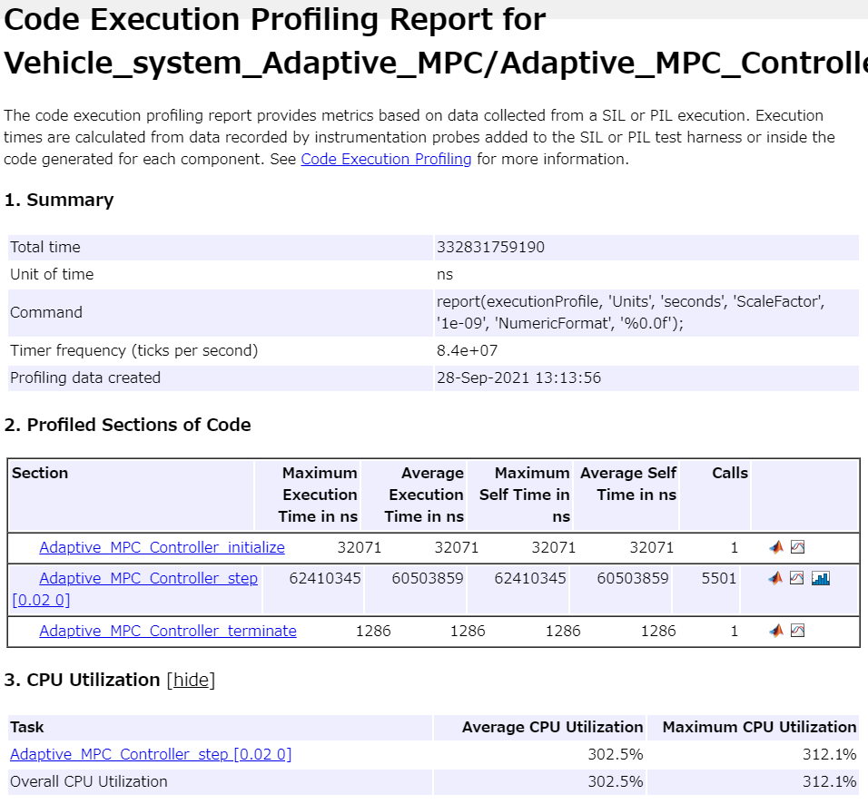
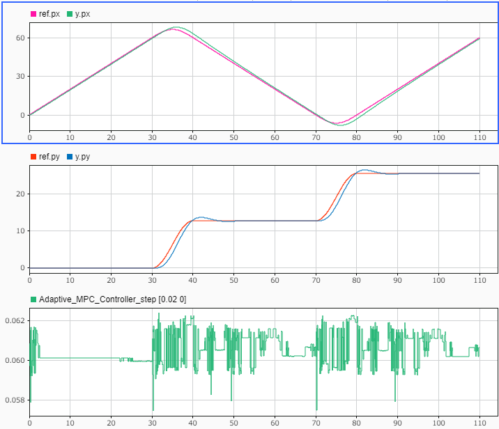
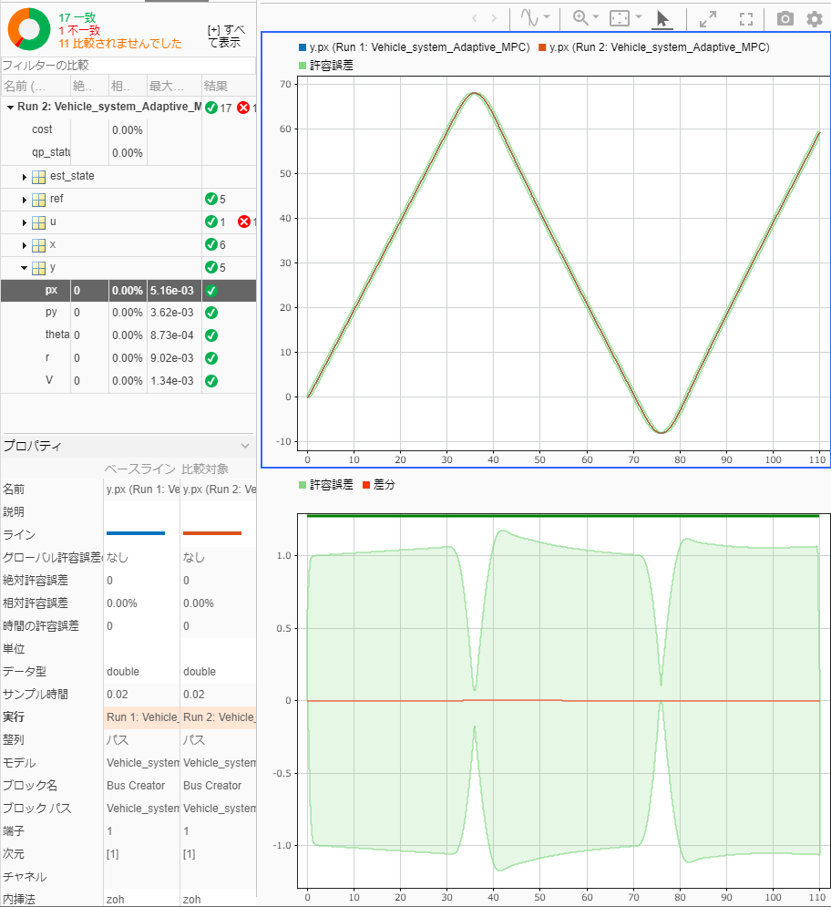

# 適応MPCコントローラのQPソルバーの設定について検討


このサンプルでは、適応MPCを設計するブロック"Adaptive MPC Controller"を用いた設計の例を示す。


最適化のソルバーとして、アクティブセット法と内点法の違いについて確認する。


また、設計後のCコード生成、SIL、PILの例も合わせて紹介する。


# 初期化

```matlab:Code
clc; Simulink.sdi.clear; Simulink.sdi.clearPreferences; Simulink.sdi.close;
proj = currentProject;
model_name = 'Vehicle_system_Adaptive_MPC';
ada_controller_name = 'Adaptive_MPC_Controller';
ts = get_TimeStep('sim_data_vehicle.sldd');

```

# プラントモデルを定式化
# 状態空間表現
# MPCのための定式化


「Adaptive_MPC_Design.mlx」と同一であるため、説明は省略する。


```matlab:Code
% 変数定義
syms m u v r F_f F_r real;
syms I l_f l_r v_dot r_dot V beta beta_dot real;
% 方程式
eq_1 = m * (v_dot + u * r) == F_f + F_r;
eq_2 = I * r_dot == l_f * F_f - l_r * F_r;
% 代入
eq_1 = subs(eq_1, [u, v_dot], [V, V * beta_dot]);
% 変数定義
syms K_f K_r delta beta_f beta_r real;
% 代入
eq_vec = subs([eq_1, eq_2], [F_f, F_r], [-2 * K_f * beta_f, -2 * K_r * beta_r]);
eq_vec = subs(eq_vec, [beta_f, beta_r], ...
              [beta + (l_f / V) * r - delta, beta - (l_r / V) * r]);
eq_1 = eq_vec(1);
eq_2 = eq_vec(2);
sol_vec = solve([eq_1, eq_2], [beta_dot, r_dot]);
beta_dot = sol_vec.beta_dot;
r_dot = sol_vec.r_dot;
normal_input_names = {'delta', 'a'};
% 変数定義
syms a real;
U = [delta; a];
state_names = {'px', 'py', 'theta', 'r', 'beta', 'V'};
% 変数定義
syms theta px py real;
X = [px; py; theta; r; beta; V];
output_names = {'px', 'py', 'theta', 'r', 'V'};
Y = [px; py; theta; r; V];
f = [ ...
    V * cos(theta);
    V * sin(theta);
    r;
    sol_vec.r_dot;
    sol_vec.beta_dot;
    a;
     ];
 h = [X(1); X(2); X(3); X(4); X(6)];
file_path = [char(proj.RootFolder), filesep, 'gen_script', filesep, 'calc_nonlinear_f.m'];
matlabFunction(f, 'File', file_path);
insert_zero_divide_avoidance(file_path);
file_path = [char(proj.RootFolder), filesep, 'gen_script', filesep, 'calc_nonlinear_h.m'];
matlabFunction(h, 'File', file_path);
insert_zero_divide_avoidance(file_path);
Ac = jacobian(f, X);
Bc = jacobian(f, U);
Cc = jacobian(h, X);
file_path = [char(proj.RootFolder), filesep, 'gen_script', filesep, 'calc_Ac.m'];
matlabFunction(Ac, 'File', file_path);
insert_zero_divide_avoidance(file_path);
file_path = [char(proj.RootFolder), filesep, 'gen_script', filesep, 'calc_Bc.m'];
matlabFunction(Bc, 'File', file_path);
insert_zero_divide_avoidance(file_path);
file_path = [char(proj.RootFolder), filesep, 'gen_script', filesep, 'calc_Cc.m'];
matlabFunction(Cc, 'File', file_path);
insert_zero_divide_avoidance(file_path);
x0 = [0; 0; 0; 0; 0; 1];
u0 = zeros(size(U, 1), 1);

uNum_MPC = size(u0, 1);
xNum_MPC = size(x0, 1);
yNum_MPC = size(Y, 1);

% パラメータ
m_val = 2000;
l_f_val = 1.4;
l_r_val = 1.6;
I_val = 4000;
K_f_val = 12e3;
K_r_val = 11e3;
div_min = 1e-3;

[Ad,Bd,Cd,Dd,Ud,Yd,Xd,DXd] = calc_Discrete_SS_for_Adaptive( ...
    I_val, K_f_val, K_r_val, l_f_val, l_r_val, m_val, ts, x0, u0, div_min);
dsys = ss(Ad, Bd, Cd, Dd, ts);
dsys.InputName = normal_input_names;
dsys.StateName = state_names;
dsys.OutputName = output_names;
```


Adaptive MPCを用いたMPC制御器を構成する。


```matlab:Code
mpcObj = mpc(dsys);
solverType = 2;
if (solverType == 1)
    % QPソルバーをアクティブセット法に指定する
%     mpcObj.Optimizer.Algorithm = 'active-set';  % デフォルトでアクティブセット法となる
    mpcObj.Optimizer.ActiveSetOptions.MaxIterations = 2;
    mpcobjSub.Optimizer.UseSuboptimalSolution = true;
else
    % QPソルバーを内点法に指定する
    mpcObj.Optimizer.Algorithm = 'interior-point';
    mpcObj.Optimizer.InteriorPointOptions.MaxIterations = 10;
    mpcobjSub.Optimizer.UseSuboptimalSolution = true;
end

% 予測ホライズン、制御ホライズンの設定
mpcObj.PredictionHorizon = 16;
mpcObj.ControlHorizon = 1;

% ノミナル状態を更新
mpcObj.Model.Nominal = struct('U',Ud,'Y',Yd,'X',Xd,'DX',DXd);

% 制約
% 操舵角は30deg以内であること
delta_limit = 30;
mpcObj.ManipulatedVariables(1).Max = delta_limit * pi / 180;
mpcObj.ManipulatedVariables(1).Min = -delta_limit * pi / 180;
% 加速度は2m/s^2以内であること
acc_limit = 2;
mpcObj.ManipulatedVariables(2).Max = acc_limit;
mpcObj.ManipulatedVariables(2).Min = -acc_limit;

% チューニング
% out_dist_model = ss(zeros(yNum_MPC), zeros(yNum_MPC), zeros(yNum_MPC), ...
%                  diag([0; 0; 0; 0; 0]), ts);
% setoutdist(mpcObj, 'model', out_dist_model);
% noise_model = ss(zeros(yNum_MPC), zeros(yNum_MPC), zeros(yNum_MPC), ...
%                  diag([2.5; 2.5; 1; 1; 0]), ts);
% mpcObj.Model.Noise = noise_model;

% 最適化の重みを設定
mpcObj.Weights.OutputVariables = [1, 1, 0, 0, 1];
mpcObj.Weights.ManipulatedVariables = [0.1, 0.1];
mpcObj.Weights.ManipulatedVariablesRate = [0.0, 0.0];

```


設計の妥当性確認


```matlab:Code
% review(mpcObj)
```

# シミュレーション

```matlab:Code
open_system(model_name);
set_param([model_name, '/MPC_Controller'], 'SimulationMode', 'Normal');
% set_param(modelName, 'SimulationCommand', 'update');
sim(model_name);
```


結果の表示


```matlab:Code
plot_vehicle_result_in_SDI;
```


アクティブセット法と内点法で結果を比較してみること。


現時点では、"UseSuboptimalSolution"のオプションは内点法では機能していない。


  
# コード生成


Embedded Coder®コード生成結果を確認する。


```matlab:Code
return;
slbuild(ada_controller_name);
```


   -  内点法の場合 


   -  アクティブセット法の場合 


内点法とアクティブセット法でグローバル変数とスタックサイズの消費に差は無いことが分かる。


# SIL検証


SILモードでモデルとコードの等価性を調べる。


```matlab:Code
return;
set_param([model_name, '/MPC_Controller'], 'SimulationMode', 'Normal');
sim(model_name);
set_param([model_name, '/MPC_Controller'], 'SimulationMode', 'Software-in-the-Loop (SIL)');
sim(model_name);
```


結果を比較する。


```matlab:Code
compare_previous_run(1);
```

# PIL検証


「Linear_MPC_Design.mlx」と同様に、STM32 Nucleo F401REを用いたPIL検証を行う。手順については、「Linear_MPC_Design.mlx」を参照。








1ステップ当たりの平均計算時間は42.7ms、CPU使用率は213.7%である。アクティブセット法と比較して、計算時間にあまり差はないことが分かる。


モデルとコードの実行の比較結果は以下のようになった。





