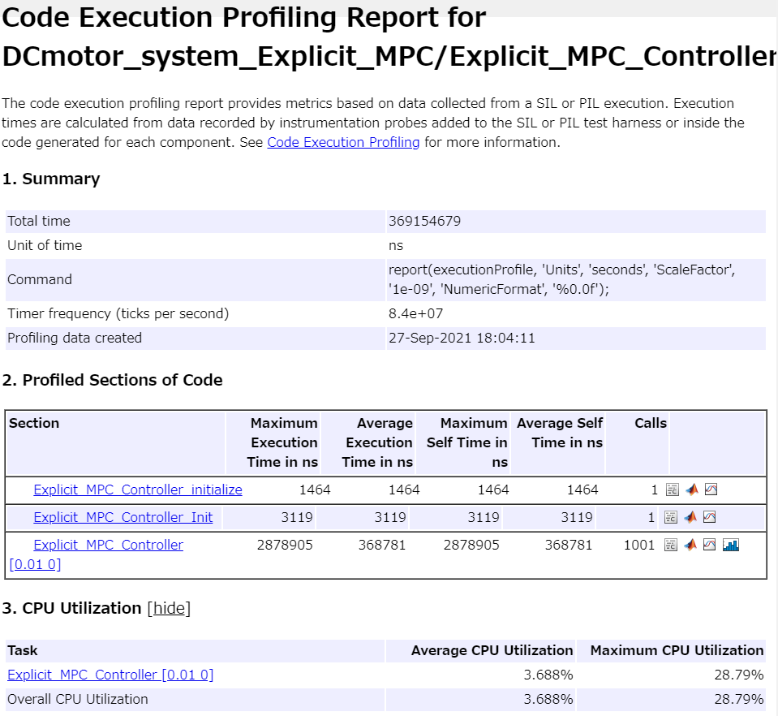

# 陽的MPCコントローラの設計と実装


このサンプルでは、線形MPCの最適操作量uをテーブル参照で求めることで高速化を図る、"Explicit MPC Controller"を用いた設計の例を示す。


また、設計後のCコード生成、SIL、PILの例も合わせて紹介する。


# 初期化

```matlab:Code
clc; Simulink.sdi.clear; Simulink.sdi.clearPreferences; Simulink.sdi.close;
model_name = 'DCmotor_system_Explicit_MPC';
lin_controller_name = 'Linear_MPC_Controller_for_DCmotor';
exp_controller_name = 'Explicit_MPC_Controller';
ts = get_TimeStep('sim_data_DCmotor_system.sldd');

```

# プラントモデルを定式化


制御対象はDCモーターである。DCモーターの近似モデルを構築する。プラントモデルは、以下の文献を参考に構築している。


[1] A. Bemporad, "Reference Governors: On-Line Set-Point Optimization Techniques for Constraint Fulfillment", Ph.D. dissertation, DSI, University of Florence, Italy, 1997.


### パラメータ定義

\hfill \break


```matlab:Code
Lshaft = 1.0;                               % シャフト長さ
dshaft = 0.02;                              % シャフト径
shaftrho = 7850;                            % シャフトの密度 (炭素鋼)
G = 81500 * 1e6;                            % 剛性率

tauam = 50 * 1e6;                           % 剪断強度

Mmotor = 100;                               % 回転子の質量
Rmotor = 0.1;                               % 回転子の半径
Jmotor = 0.5 * Mmotor * Rmotor ^ 2;         % 回転子軸に対する慣性モーメント
Bmotor = 0.1;                               % 回転子の粘性摩擦係数(A CASO)
R = 20;                                     % 接触子の抵抗
Kt = 10;                                    % モーター定数

gear = 20;                                  % ギア比

Jload = 50*Jmotor;                          % 負荷の公称慣性モーメント
Bload = 25;                                 % 負荷の公称粘性摩擦係数

Ip = pi / 32 * dshaft ^ 4;                  % シャフトの極モーメント
Kth = G * Ip / Lshaft;                      % ねじれ剛性 (トルク/角度)
Vshaft = pi * (dshaft ^ 2) / 4 * Lshaft;    % シャフトの体積
Mshaft = shaftrho * Vshaft;                 % シャフトの質量
Jshaft = Mshaft * 0.5 * (dshaft ^ 2 / 4);   % シャフトの慣性モーメント

JM = Jmotor; 
JL = Jload + Jshaft;

```

### 連続の状態空間モデルを定義

\hfill \break


```matlab:Code

AA = [0             1             0                 0;
      -Kth/JL       -Bload/JL     Kth/(gear*JL)     0;
      0             0             0                 1;
      Kth/(JM*gear) 0             -Kth/(JM*gear^2)  -(Bmotor+Kt^2/R)/JM];
                
BB = [0; 0; 0; Kt/(R*JM)];

Hy = [1, 0, 0, 0];
Hv = [Kth, 0, -Kth/gear, 0];

Dy = 0;
Dv = 0;

tau = tauam * pi * dshaft ^ 3 / 16; % 最大許容トルク

dc_motor_plant_sys = ss(AA, BB, [Hy; Hv], [Dy; Dv]);
dc_motor_plant_sys.InputUnit = {'V'};
dc_motor_plant_sys.OutputUnit = {'rad';'Nm'};
```

  
# MPCオブジェクトを作る

```matlab:Code
% プラントモデルの入出力のタイプを指定する
plant = setmpcsignals(dc_motor_plant_sys, ...
                        'MV', 1, 'MO', 1, 'UO', 2);

% mpcオブジェクトを構築する
mpcObj = mpc(dc_motor_plant_sys, ts);
```


```text:Output
-->"mpc" オブジェクトの "PredictionHorizon" プロパティが空です。PredictionHorizon = 10 を試用します。
-->"mpc" オブジェクトの "ControlHorizon" プロパティが空です。2 であると仮定します。
-->"mpc" オブジェクトの "Weights.ManipulatedVariables" プロパティが空です。既定の 0.00000 を仮定します。
-->"mpc" オブジェクトの "Weights.ManipulatedVariablesRate" プロパティが空です。既定の 0.10000 を仮定します。
-->"mpc" オブジェクトの "Weights.OutputVariables" プロパティが空です。既定の 1.00000 を仮定します。
   for output(s) y1 and zero weight for output(s) y2 
```


```matlab:Code

% 予測ホライズン、制御ホライズンを指定する
mpcObj.PredictionHorizon = 32;
mpcObj.ControlHorizon = 2;

% 制約を指定する
% 操作量の電圧は+/-220[V]となるようにする
mpcObj.ManipulatedVariables.Min = -220;
mpcObj.ManipulatedVariables.Max = 220;
% 電圧のスケールが大きいため、チューニングをしやすくするためのスケーリング調整を行う
% ScaleFactorは一般的には上下限値、または動作領域を指定する
mpcObj.ManipulatedVariables.ScaleFactor = 440;

% 陽的MPCの複雑さ軽減のため、トルクの出力制約は最初の3ステップまで指定する。
mpcObj.OutputVariables(1).Min = -Inf;
mpcObj.OutputVariables(2).Min = [-tau; -tau; -tau; -Inf];
mpcObj.OutputVariables(1).Max = Inf;
mpcObj.OutputVariables(2).Max = [tau; tau; tau; Inf];
mpcObj.OutputVariables(1).ScaleFactor = 2 * pi;
mpcObj.OutputVariables(2).ScaleFactor = 2 * tau;

% 重みを指定する
mpcObj.Weights.ManipulatedVariables = 0;
mpcObj.Weights.ManipulatedVariablesRate = 0.1;
mpcObj.Weights.OutputVariables = [1, 0];
```

### 陽的MPCを構築

\hfill \break


```matlab:Code
% レンジを取得する
range = generateExplicitRange(mpcObj);
```


```text:Output
-->モデルを離散時間に変換します。
   測定出力チャネル #1 に外乱が追加されていないと仮定します。
-->測定出力チャネル #2 に追加された出力外乱は、合成ホワイト ノイズであると仮定します。
-->"mpc" オブジェクトの "Model.Noise" プロパティが空です。それぞれの測定出力チャネルにホワイト ノイズを仮定します。
```


```matlab:Code

% 状態の最大最小を指定する
range.State.Min(:) = -1000;
range.State.Max(:) = 1000;

% 指令値の最大最小を指定する
range.Reference.Min = [-5; 0];
range.Reference.Max = [5; 0];

% 操作量の最大最小を指定する
range.ManipulatedVariable.Min = mpcObj.ManipulatedVariables.Min - 1;
range.ManipulatedVariable.Max = mpcObj.ManipulatedVariables.Max + 1;

% 陽的MPCオブジェクトを作成する
mpcObjExplicit = generateExplicitMPC(mpcObj,range)
```


```text:Output
Regions found / unexplored:       89/       0

 
Explicit MPC Controller
---------------------------------------------
Controller sample time:    0.01 (seconds)
Polyhedral regions:        89
Number of parameters:      7
Is solution simplified:    No
State Estimation:          Default Kalman gain
---------------------------------------------
Type 'mpcObjExplicit.MPC' for the original implicit MPC design.
Type 'mpcObjExplicit.Range' for the valid range of parameters.
Type 'mpcObjExplicit.OptimizationOptions' for the options used in multi-parametric QP computation.
Type 'mpcObjExplicit.PiecewiseAffineSolution' for regions and gain in each solution.
```


```matlab:Code

```

# シミュレーション


モデルを実行して動作を確認する。


```matlab:Code
open_system(model_name);
```


「controller_sw」で制御方式を切り替えられるようにしている。ここでは線形MPC制御と陽的MPC制御の比較を行う。


```matlab:Code
controller_sw = 1;
sim(model_name);
controller_sw = 2;
sim(model_name);
```


結果を比較する。


```matlab:Code
compare_previous_run;
```

# コード生成


Embedded Coderによるコード生成結果を確認する。


```matlab:Code
return;
rtwbuild(exp_controller_name);
```


ここで、線形MPCと陽的MPCのCコードのメモリ消費量を比較する。


## 線形MPC


## 陽的MPC


グローバル変数、累積スタックサイズ共に陽的MPCの方が消費が少ないことが分かる。


  
# SIL検証


SILモードでモデルとコードの等価性を調べる。


```matlab:Code
% return;
controller_sw = 2;

set_param([model_name, '/Explicit_MPC_Controller'], 'SimulationMode', 'Normal');
sim(model_name);
set_param([model_name, '/Explicit_MPC_Controller'], 'SimulationMode', 'Software-in-the-Loop (SIL)');
sim(model_name);
```


結果を比較する。


```matlab:Code
compare_previous_run;
```


計算結果は必ずしも一致するわけではない。アルゴリズムの計算は浮動小数点で行われているため、例えば四則演算の計算順序が変わると結果が僅かに異なる場合がある。コード生成前後で四則演算の順序は変わる可能性がある。


# PIL検証


「Linear_MPC_Design.mlx」と同様に、STM32 Nucleo F401REを用いたPIL検証を行う。手順については、「Linear_MPC_Design.mlx」を参照。


ここでは、線形MPCと陽的MPCの計算時間の比較を行う。


## 線形MPC


  
## 陽的MPC





  


比較すると、過渡時は線形MPCの方が計算負荷が少なく、定常時は陽的MPCの方が計算負荷が少ないことが分かる。


