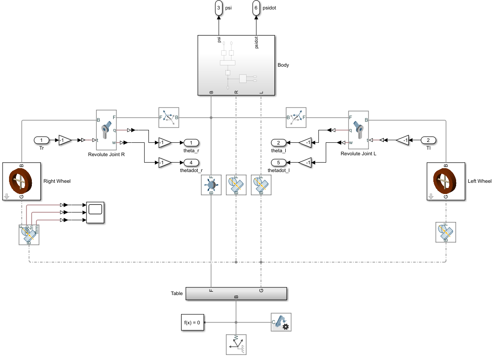
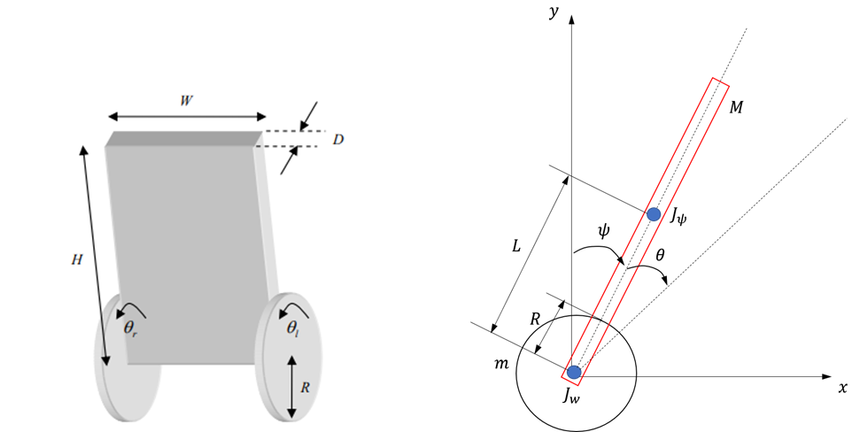
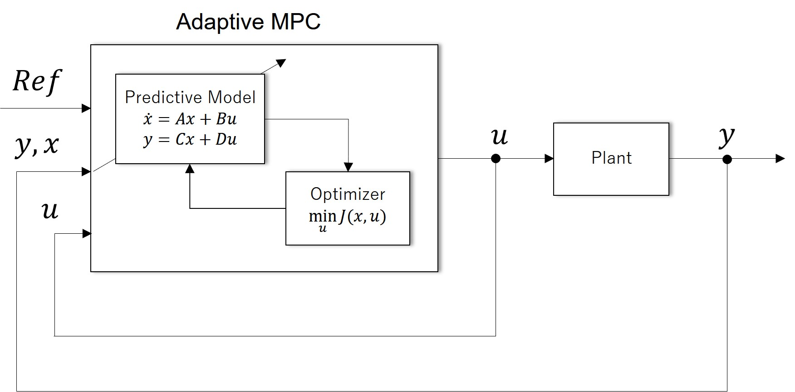
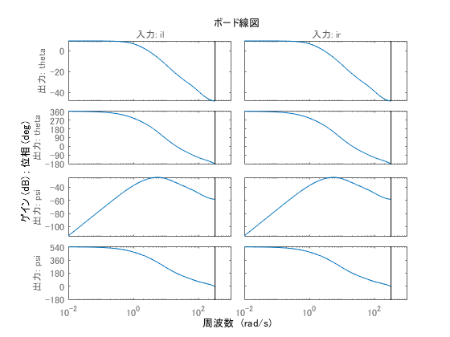
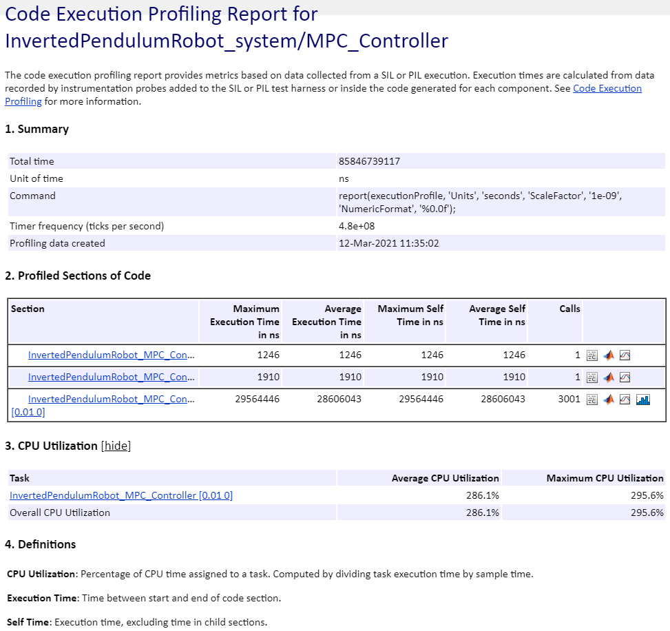
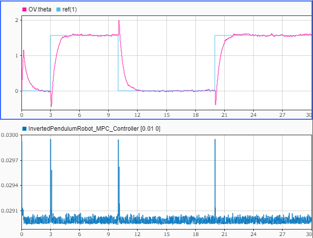
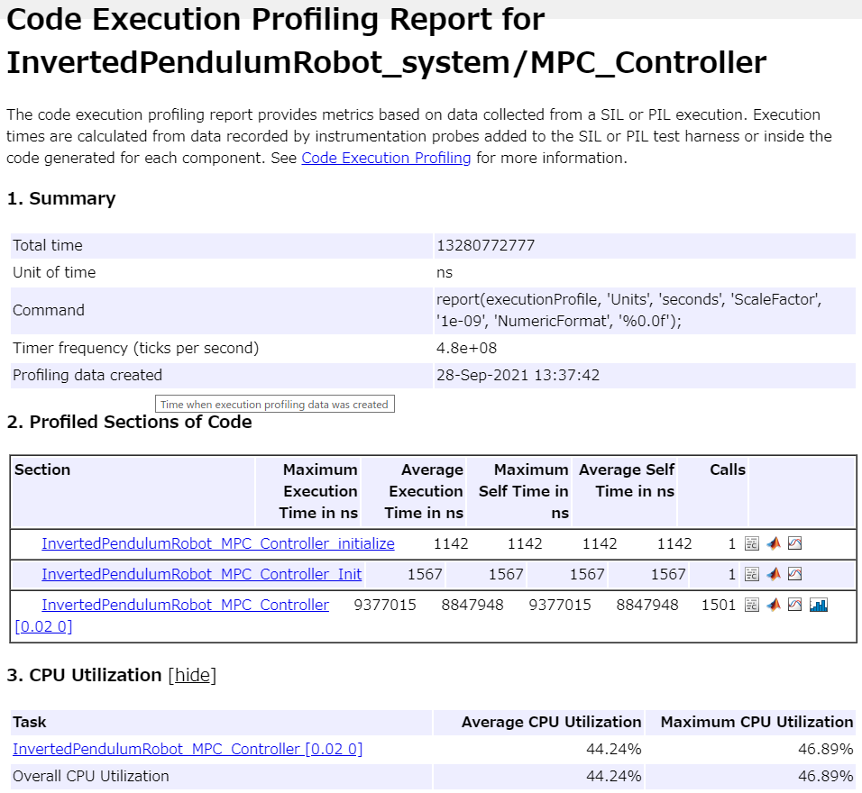
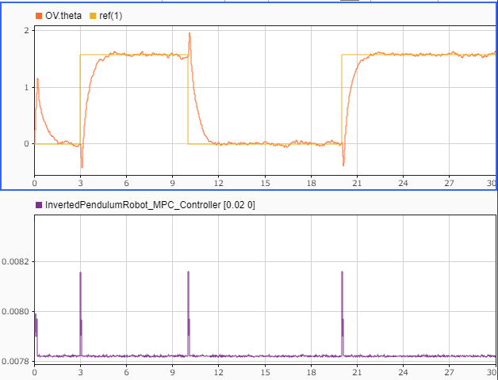

# 適応モデル予測制御による倒立制御走行ロボットの倒立制御


2輪型倒立振子に対し、適応モデル予測制御を利用して、倒立制御の設計を行う。


また、設計後のCコード生成、SIL、PILの例も合わせて紹介する。


# 初期化

```matlab:Code
clc; Simulink.sdi.clear; Simulink.sdi.clearPreferences; Simulink.sdi.close;
proj = currentProject;
model_name = 'InvertedPendulumRobot_system';
ada_controller_name = 'InvertedPendulumRobot_MPC_Controller';
ts = get_TimeStep('InvertedPendulumRobot_data.sldd');

```

# プラントモデリング


プラントモデルをSimscape Multibodyを用いて構築した。モデルを開いて確認すること。タイヤとボディはRevolute Jointで繋ぎ、タイヤと地面の間は接触力のブロックで接続している。





# プラントモデルを定式化


倒立制御走行ロボットは以下のFig.1のような構成である。車両の正面方向をx軸、上方向をy軸とする。





> Fig.1　2輪型倒立振子の概念図


：左右車輪の平均回転角度,  ：車体の傾斜角（ピッチ角）


横方向の運動（ヨー角）は今回は考慮しないものとする。


  


ラグランジュの運動方程式より、倒立振子ロボットの非線形運動モデルを算出する。


```matlab:Code
% 変数定義
syms m M R Jw Jpsi fm fw L g K real;
syms theta_ddot theta_dot theta psi_ddot psi_dot psi real;
syms F_theta Fl Fr ir il real;
```


運動エネルギーを定義する。


```matlab:Code
% タイヤの回転運動
Twr = 0.5*Jw*(theta_dot+psi_dot)^2;

% ボディの回転運動
TBr = 0.5*Jpsi*psi_dot^2;

% タイヤの並進運動
Twh = 0.5*m*(R*(theta_dot+psi_dot))^2;

% ボディの並進運動
xc = R*(theta+psi); yc = 0;                                 % タイヤの中心座標
xp = xc + L*sin(psi); yp = yc + L*cos(psi);                 % ボディの中心座標
Vx = R*(theta_dot+psi_dot)+L*psi_dot*(cos(psi));            % ボディの中心の並進速度 
Vy = -L*psi_dot*sin(psi);    
TBt = 0.5*M*(Vx^2+Vy^2);

% 合計の運動エネルギー
T = Twr + TBr + Twh + TBt;
```


位置エネルギーを定義する。


```matlab:Code
U = M*g*yp;
```


損失エネルギーを定義する。


```matlab:Code
D = 0.5*fm*psi_dot^2 + 0.5*fw*theta_dot^2;
```


一般化座標を定義する。


```matlab:Code
q = [theta;psi];                % 位置
dq = [theta_dot;psi_dot];       % 速度
ddq = [theta_ddot;psi_ddot];    % 加速度
```


一般化力を定義する。


```matlab:Code
f = [F_theta;0];
```


ラグランジアンLを定義する。


```matlab:Code
L = T - U;
```


ラグランジュの運動方程式は以下の(1)式である。


                                (1)


ここで、(1)式の左辺を導出する。


```matlab:Code
N = length(q);
for i = 1:N
  dLq(i)  = diff(L,dq(i));  %dL/dqdot
  
  % d/dt(dL/dqdot)
  temp = 0;
  for j = 1:N
    temp = temp + diff(dLq(i),dq(j))*ddq(j) ...
                + diff(dLq(i),q(j))*dq(j);
  end
  ddLq(i) = temp;
  
  % d/dt(dL/dqdot) - dL/dqdot + dD/dqdot = f
  eq(i) = ddLq(i) - diff(L,q(i)) ...
        + diff(D,dq(i)) - f(i);
end

eq = simplify(eq');
eq = collect(eq,[theta_ddot, psi_ddot, theta_dot, psi_dot])
```

eq = 

   


次に、アクチュエータ部分の定式化を行う。ここでは簡単化のため、制御器の操作量（電流指令値）に比例してトルクが発生するものとする。


上記で求めた運動方程式に代入する。


```matlab:Code
X = [theta_ddot; psi_ddot];
Fl = K * il; 
Fr = K * ir;
eq = subs(eq,F_theta,Fl+Fr);
```


状態空間モデルに帰着させるために、theta_ddotとpsi_ddotについて解く。


```matlab:Code
nl_sol = solve(eq,X);
fcn = [nl_sol.theta_ddot;
       nl_sol.psi_ddot]
```

fcn = 

   


得られた計算式をMATLABコード生成する。


```matlab:Code
file_path = [char(proj.RootFolder), filesep, 'gen_script', filesep, 'nlStateFcn.m'];
matlabFunction(fcn, 'File', file_path);
```

# Adaptive MPC のための線形近似システムの導出


Adaptive MPCは、非線形モデルを逐次線形化してモデル予測制御を行っている。そこで、非線形方程式の線形化を行い、状態空間モデルに帰着させる。


状態X、入力U、出力Y


```matlab:Code
X = [theta; psi; theta_dot; psi_dot];
U = [il; ir];
Y = [theta; psi];
```


非線形の状態方程式


```matlab:Code
nlstate = [theta_dot;
           psi_dot;
           fcn];
```


線形近似の係数行列を導出する。


```matlab:Code
Ac = jacobian(nlstate,X)
```

Ac = 

   <img src="https://latex.codecogs.com/gif.latex?&space;\begin{array}{l}&space;\left(\begin{array}{cccc}&space;0&space;&&space;0&space;&&space;1&space;&&space;0\\&space;0&space;&&space;0&space;&&space;0&space;&&space;1\\&space;0&space;&&space;-\frac{\sigma_6&space;-\sigma_4&space;+\sigma_3&space;+\sigma_{18}&space;+L^2&space;\,M^2&space;\,R\,g\,{\cos&space;\left(\psi&space;\right)}^2&space;-L^3&space;\,M^2&space;\,R\,{\dot{\psi}&space;}^2&space;\,\cos&space;\left(\psi&space;\right)-L^2&space;\,M^2&space;\,R\,g\,{\sin&space;\left(\psi&space;\right)}^2&space;+L\,M\,R\,\textrm{fm}\,\dot{\psi}&space;\,\sin&space;\left(\psi&space;\right)-2\,L\,M\,R\,\textrm{fw}\,\dot{\theta}&space;\,\sin&space;\left(\psi&space;\right)-\textrm{Jpsi}\,L\,M\,R\,{\dot{\psi}&space;}^2&space;\,\cos&space;\left(\psi&space;\right)+\sigma_8&space;+2\,K\,L\,M\,R\,\textrm{il}\,\sin&space;\left(\psi&space;\right)+2\,K\,L\,M\,R\,\textrm{ir}\,\sin&space;\left(\psi&space;\right)}{\sigma_1&space;}-\frac{2\,L^2&space;\,M^2&space;\,R^2&space;\,\cos&space;\left(\psi&space;\right)\,\sin&space;\left(\psi&space;\right)\,{\left(\textrm{Jpsi}\,K\,\textrm{il}+\textrm{Jpsi}\,K\,\textrm{ir}+\textrm{Jw}\,K\,\textrm{il}+\textrm{Jw}\,K\,\textrm{ir}+\textrm{Jw}\,\textrm{fm}\,\dot{\psi}&space;-\textrm{Jpsi}\,\textrm{fw}\,\dot{\theta}&space;-\textrm{Jw}\,\textrm{fw}\,\dot{\theta}&space;+K\,L^2&space;\,M\,\textrm{il}+K\,L^2&space;\,M\,\textrm{ir}+\sigma_{14}&space;+\sigma_{13}&space;+\sigma_{12}&space;+\sigma_{11}&space;-L^2&space;\,M\,\textrm{fw}\,\dot{\theta}&space;+\sigma_{10}&space;-\sigma_9&space;+\sigma_{20}&space;-\sigma_{19}&space;-\sigma_5&space;-\sigma_{17}&space;+L^3&space;\,M^2&space;\,R\,{\dot{\psi}&space;}^2&space;\,\sin&space;\left(\psi&space;\right)-L^2&space;\,M^2&space;\,R\,g\,\cos&space;\left(\psi&space;\right)\,\sin&space;\left(\psi&space;\right)+\textrm{Jpsi}\,L\,M\,R\,{\dot{\psi}&space;}^2&space;\,\sin&space;\left(\psi&space;\right)-\sigma_7&space;+2\,K\,L\,M\,R\,\textrm{il}\,\cos&space;\left(\psi&space;\right)+2\,K\,L\,M\,R\,\textrm{ir}\,\cos&space;\left(\psi&space;\right)+\sigma_2&space;+L\,M\,R\,\textrm{fm}\,\dot{\psi}&space;\,\cos&space;\left(\psi&space;\right)-2\,L\,M\,R\,\textrm{fw}\,\dot{\theta}&space;\,\cos&space;\left(\psi&space;\right)\right)}}{{\sigma_1&space;}^2&space;}&space;&&space;-\frac{\textrm{Jpsi}\,\textrm{fw}+\textrm{Jw}\,\textrm{fw}+L^2&space;\,M\,\textrm{fw}+\sigma_{16}&space;+\sigma_{15}&space;+2\,L\,M\,R\,\textrm{fw}\,\cos&space;\left(\psi&space;\right)}{\sigma_1&space;}&space;&&space;\frac{\textrm{Jw}\,\textrm{fm}+M\,R^2&space;\,\textrm{fm}+R^2&space;\,\textrm{fm}\,m+2\,L^3&space;\,M^2&space;\,R\,\dot{\psi}&space;\,\sin&space;\left(\psi&space;\right)+L\,M\,R\,\textrm{fm}\,\cos&space;\left(\psi&space;\right)+2\,L^2&space;\,M^2&space;\,R^2&space;\,\dot{\psi}&space;\,\cos&space;\left(\psi&space;\right)\,\sin&space;\left(\psi&space;\right)+2\,\textrm{Jpsi}\,L\,M\,R\,\dot{\psi}&space;\,\sin&space;\left(\psi&space;\right)}{\sigma_1&space;}\\&space;0&space;&&space;\frac{\sigma_6&space;-\sigma_4&space;+\sigma_3&space;+\sigma_{18}&space;-L\,M\,R\,\textrm{fw}\,\dot{\theta}&space;\,\sin&space;\left(\psi&space;\right)+\sigma_8&space;+K\,L\,M\,R\,\textrm{il}\,\sin&space;\left(\psi&space;\right)+K\,L\,M\,R\,\textrm{ir}\,\sin&space;\left(\psi&space;\right)}{\sigma_1&space;}+\frac{2\,L^2&space;\,M^2&space;\,R^2&space;\,\cos&space;\left(\psi&space;\right)\,\sin&space;\left(\psi&space;\right)\,{\left(\textrm{Jw}\,K\,\textrm{il}+\textrm{Jw}\,K\,\textrm{ir}+\textrm{Jw}\,\textrm{fm}\,\dot{\psi}&space;-\textrm{Jw}\,\textrm{fw}\,\dot{\theta}&space;+\sigma_{14}&space;+\sigma_{13}&space;+\sigma_{12}&space;+\sigma_{11}&space;+\sigma_{10}&space;-\sigma_9&space;+\sigma_{20}&space;-\sigma_{19}&space;-\sigma_5&space;-\sigma_{17}&space;-\sigma_7&space;+K\,L\,M\,R\,\textrm{il}\,\cos&space;\left(\psi&space;\right)+K\,L\,M\,R\,\textrm{ir}\,\cos&space;\left(\psi&space;\right)+\sigma_2&space;-L\,M\,R\,\textrm{fw}\,\dot{\theta}&space;\,\cos&space;\left(\psi&space;\right)\right)}}{{\sigma_1&space;}^2&space;}&space;&&space;\frac{\textrm{Jw}\,\textrm{fw}+\sigma_{16}&space;+\sigma_{15}&space;+L\,M\,R\,\textrm{fw}\,\cos&space;\left(\psi&space;\right)}{\sigma_1&space;}&space;&&space;-\frac{2\,\dot{\psi}&space;\,\cos&space;\left(\psi&space;\right)\,\sin&space;\left(\psi&space;\right)\,L^2&space;\,M^2&space;\,R^2&space;+\textrm{fm}\,M\,R^2&space;+\textrm{fm}\,m\,R^2&space;+\textrm{Jw}\,\textrm{fm}}{\sigma_1&space;}&space;\end{array}\right)\\&space;\mathrm{}\\&space;\textrm{where}\\&space;\mathrm{}\\&space;\;\;\sigma_1&space;=-L^2&space;\,M^2&space;\,R^2&space;\,{\cos&space;\left(\psi&space;\right)}^2&space;+L^2&space;\,M^2&space;\,R^2&space;+m\,L^2&space;\,M\,R^2&space;+\textrm{Jw}\,L^2&space;\,M+\textrm{Jpsi}\,M\,R^2&space;+\textrm{Jpsi}\,m\,R^2&space;+\textrm{Jpsi}\,\textrm{Jw}\\&space;\mathrm{}\\&space;\;\;\sigma_2&space;=L^2&space;\,M^2&space;\,R^2&space;\,{\dot{\psi}&space;}^2&space;\,\cos&space;\left(\psi&space;\right)\,\sin&space;\left(\psi&space;\right)\\&space;\mathrm{}\\&space;\;\;\sigma_3&space;=L^2&space;\,M^2&space;\,R^2&space;\,{\dot{\psi}&space;}^2&space;\,{\sin&space;\left(\psi&space;\right)}^2&space;\\&space;\mathrm{}\\&space;\;\;\sigma_4&space;=L^2&space;\,M^2&space;\,R^2&space;\,{\dot{\psi}&space;}^2&space;\,{\cos&space;\left(\psi&space;\right)}^2&space;\\&space;\mathrm{}\\&space;\;\;\sigma_5&space;=L\,M^2&space;\,R^2&space;\,g\,\sin&space;\left(\psi&space;\right)\\&space;\mathrm{}\\&space;\;\;\sigma_6&space;=L\,M^2&space;\,R^2&space;\,g\,\cos&space;\left(\psi&space;\right)\\&space;\mathrm{}\\&space;\;\;\sigma_7&space;=L\,M\,R^2&space;\,g\,m\,\sin&space;\left(\psi&space;\right)\\&space;\mathrm{}\\&space;\;\;\sigma_8&space;=L\,M\,R^2&space;\,g\,m\,\cos&space;\left(\psi&space;\right)\\&space;\mathrm{}\\&space;\;\;\sigma_9&space;=M\,R^2&space;\,\textrm{fw}\,\dot{\theta}&space;\\&space;\mathrm{}\\&space;\;\;\sigma_{10}&space;=M\,R^2&space;\,\textrm{fm}\,\dot{\psi}&space;\\&space;\mathrm{}\\&space;\;\;\sigma_{11}&space;=K\,R^2&space;\,\textrm{ir}\,m\\&space;\mathrm{}\\&space;\;\;\sigma_{12}&space;=K\,R^2&space;\,\textrm{il}\,m\\&space;\mathrm{}\\&space;\;\;\sigma_{13}&space;=K\,M\,R^2&space;\,\textrm{ir}\\&space;\mathrm{}\\&space;\;\;\sigma_{14}&space;=K\,M\,R^2&space;\,\textrm{il}\\&space;\mathrm{}\\&space;\;\;\sigma_{15}&space;=R^2&space;\,\textrm{fw}\,m\\&space;\mathrm{}\\&space;\;\;\sigma_{16}&space;=M\,R^2&space;\,\textrm{fw}\\&space;\mathrm{}\\&space;\;\;\sigma_{17}&space;=\textrm{Jw}\,L\,M\,g\,\sin&space;\left(\psi&space;\right)\\&space;\mathrm{}\\&space;\;\;\sigma_{18}&space;=\textrm{Jw}\,L\,M\,g\,\cos&space;\left(\psi&space;\right)\\&space;\mathrm{}\\&space;\;\;\sigma_{19}&space;=R^2&space;\,\textrm{fw}\,m\,\dot{\theta}&space;\\&space;\mathrm{}\\&space;\;\;\sigma_{20}&space;=R^2&space;\,\textrm{fm}\,m\,\dot{\psi}&space;&space;\end{array}"/>

```matlab:Code
Bc = jacobian(nlstate,U)
```

Bc = 

   

```matlab:Code
Cc = jacobian(Y,X)
```

Cc = 

   


得られた計算式をMATLABコード生成する。


```matlab:Code
file_path = [char(proj.RootFolder), filesep, 'gen_script', filesep, 'calc_nlstate.m'];
matlabFunction(nlstate, 'File', file_path);
file_path = [char(proj.RootFolder), filesep, 'gen_script', filesep, 'calc_Ac.m'];
matlabFunction(Ac, 'File', file_path);
file_path = [char(proj.RootFolder), filesep, 'gen_script', filesep, 'calc_Bc.m'];
matlabFunction(Bc, 'File', file_path);
file_path = [char(proj.RootFolder), filesep, 'gen_script', filesep, 'calc_Cc.m'];
matlabFunction(Cc, 'File', file_path);
```

# プラントモデルのパラメーターを定義

```matlab:Code
param.g = 9.81;                                 % 重力加速度 [m/sec2]
param.m = 0.03;                                 % 車輪質量 [kg]
param.R = 0.04;                                 % 車輪半径 [m]
param.Jw = param.m*param.R^2/2;                 % 車輪慣性モーメント [kgm2]
param.M = 0.6;                                  % 車体質量 [kg]
param.W = 0.14;                                 % 車体幅 [m]
param.D = 0.01;                                 % 車体奥行き [m]
param.H = 0.144;                                % 車体高さ [m]
param.L = param.H/2;                            % 車輪中心から車体重心までの距離 [m]
param.Jpsi = param.M*param.L^2/3;               % 車体慣性モーメント（ピッチ） [kgm2]
param.Jphi = param.M*(param.W^2+param.D^2)/12;  % 車体慣性モーメント（ヨー） [kgm2]
param.Kt = 0.317;                               % DCモータートルク定数 [Nm/A]
param.n = 1;                                    % ギアレシオ
param.K = param.Kt*param.n;                     % 電流からトルクへの変換係数
param.fm = 1e-4;                                % 車体とDCモーター間の摩擦係数
param.fw = 0.4;                                 % 車輪と路面間の摩擦係数
```

# Adaptive MPCコントローラーの設計


導出したプラントモデルの計算式を用いて、適応MPCを構成する。適応MPCは、以下のFig.2のようなブロック図で表現できる。





　　　　　　　　　　　Fig.2　制御系のブロック線図


MPCオブジェクトを定義する。


最初に係数行列と状態の初期化を行う必要がある。


```matlab:Code
x0 = zeros(4,1);
u0 = zeros(2,1);

[~,~,Ac,Bc,Cc,Dc] = InvertedPendulumRobot_CT(x0, u0, param);
plant = ss(Ac,Bc,Cc,Dc);
state_names = {'theta', 'psi', 'theta_dot', 'psi_dot'};
output_names = {'theta', 'psi'};
input_names = {'il', 'ir'};
plant.InputName = input_names;
plant.StateName = state_names;
plant.OutputName = output_names;
plant
```


```text:Output
plant =
 
  A = 
                  theta        psi  theta_dot    psi_dot
   theta              0          0          1          0
   psi                0          0          0          1
   theta_dot          0       -904      -2669     0.2133
   psi_dot            0        338      853.2   -0.07976
 
  B = 
                  il      ir
   theta           0       0
   psi             0       0
   theta_dot    2116    2116
   psi_dot    -676.2  -676.2
 
  C = 
              theta        psi  theta_dot    psi_dot
   theta          1          0          0          0
   psi            0          1          0          0
 
  D = 
          il  ir
   theta   0   0
   psi     0   0
 
連続時間状態空間モデル。
```


MPCのオブジェクト作成とパラメータを定義する。


```matlab:Code
% 予測ホライズン
PredictionHorizon = 60;
% 制御ホライズン
ControlHorizon = 2;

% オブジェクト作成
MPC_verbosity = mpcverbosity('off');
mpcobj = mpc(c2d(plant,ts),ts,PredictionHorizon,ControlHorizon);

% 入力制約
mpcobj.MV(1).Max = 4;
mpcobj.MV(2).Max = 4;
mpcobj.MV(1).Min = -4;
mpcobj.MV(2).Min = -4;
% mpcobj.MV(1).RateMax = 1e-1;
% mpcobj.MV(2).RateMax = 1e-1;
% mpcobj.MV(1).RateMin = -1e-1;
% mpcobj.MV(2).RateMin = -1e-1;

% 出力（ピッチ角）に対する制約
mpcobj.OV(2).Max = 90*pi/180;
mpcobj.OV(2).Min = -90*pi/180;

% コスト関数の重み
mpcobj.Weights.OV = [10 10];
mpcobj.Weights.MVRate = [1 1];
mpcobj.Weights.ECR = 100;

% QPソルバーのアルゴリズムを選択
% mpcobj.Optimizer.Algorithm = 'interior-point';

% オブジェクトのチェック
% review(mpcobj)

% コントローラの初期状態
stateobj = mpcstate(mpcobj);
psi_0 = 10;
stateobj.plant = [0;psi_0*pi/180;0;0];
```

# 安定性の解析


構成したMPCの理論的な安定性を以下のように評価することができる。


```matlab:Code
MPCss = ss(mpcobj);
clsys = feedback(c2d(plant,ts),MPCss,[1 2],[1 2],1);
eig(clsys)
```


```text:Output
ans = 11x1 complex    
   0.3215 + 0.3400i
   0.3215 - 0.3400i
   0.9496 + 0.0000i
   0.9802 + 0.0000i
   0.9778 + 0.0000i
   0.8659 + 0.0000i
   0.8725 + 0.0000i
   0.8726 + 0.0000i
   1.0000 + 0.0000i
  -0.0000 + 0.0000i

```


```matlab:Code
bode(clsys)
```




# シミュレーション


モデルを実行して動作を確認する。


```matlab:Code
open_system(model_name);
set_param([model_name, '/MPC_Controller'], 'SimulationMode', 'Normal');
sim(model_name);
```


結果を表示する。


```matlab:Code
plot_IPR_result_in_SDI;
```


合わせて、Mechanics Explorerに表示される3Dのモデルの動作も確認すること。


# コード生成


Embedded Coder®コード生成結果を確認する。


```matlab:Code
return;
slbuild(ada_controller_name);
```

# SIL検証


SILモードでモデルとコードの等価性を調べる。


```matlab:Code
return;
set_param([model_name, '/MPC_Controller'], 'SimulationMode', 'Normal');
sim(model_name);
set_param([model_name, '/MPC_Controller'], 'SimulationMode', 'Software-in-the-Loop (SIL)');
sim(model_name);
```


結果を比較する。


```matlab:Code
compare_previous_run(1);
```

# PIL検証


本節では、例としてSTM32 Nucleo H743ZI2を用いたPIL検証を行う。STM32 Nucleo H743ZI2の性能は以下の通りである。


   -  CPU: Coretex-M7 
   -  Clock: 400MHz 
   -  Flash ROM: 2MB 
   -  SRAM: 864kB 


PIL検証の手順は使用する環境に依存しているため、本節ではコードを用いた説明は行わない。以下の手順を参考に、各自の実装環境で行うこと。


   1.  "InvertedPendulumRobot_MPC_Controller.slx"のコンフィギュレーションをPIL実行用の設定に変更する。参考までに、"InvertedPendulumRobot_data.sldd"の中のコンフィギュレーション"controller_config_PIL"が、今回行ったPIL検証の設定である。 
   1.  参照モデル"MPC_Controller"のシミュレーションモードを'Processor-in-the-loop (PIL)'とする。または、"InvertedPendulumRobot_MPC_Controller.slx"をビルドし、PILブロックを生成し、"MPC_Controller"と置き換える。 
   1.  参照モデルを用いる場合は、"InvertedPendulumRobot_system.slx"の方のコンフィギュレーションも"タスク実行時間を計測する"にチェックを入れる必要がある。 
   1.  モデル"InvertedPendulumRobot_system.slx"を実行する。 


実行の際には、事前にSTM32 Nucleo H743ZI2をUSBでPCに接続し、ポートの指定を正しく行うこと。


今回は以下のような結果が得られた。








1ステップ当たりの平均計算時間は34.3ms、CPU使用率は342.9%である。


ここで、予測ホライズンを30ステップ、サンプリングタイムステップを20msに変更する。この場合、予測区間の時間的長さは変更前と同一であり、制御の応答性能に影響がないことが確認できた。


変更後、PIL実行を行った結果、以下のようになった。








1ステップ当たりの平均計算時間は8.85ms、CPU使用率は44.24%である。


  
## 参考文献 :


1) 川田 昌克 編著ほか　倒立振子で学ぶ制御工学　森北出版


2) トランジスタ技術 2019年7月


