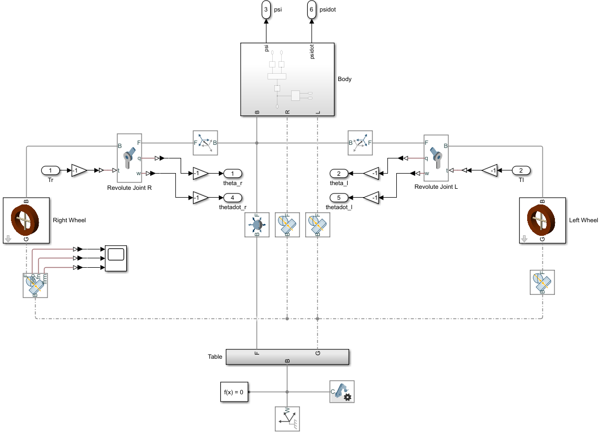
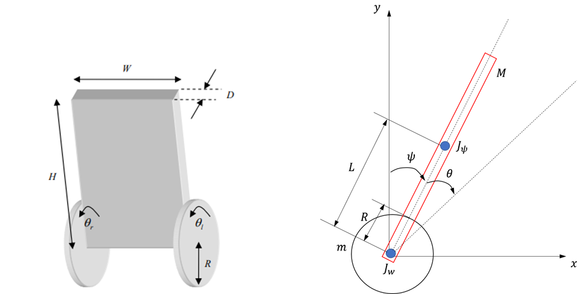
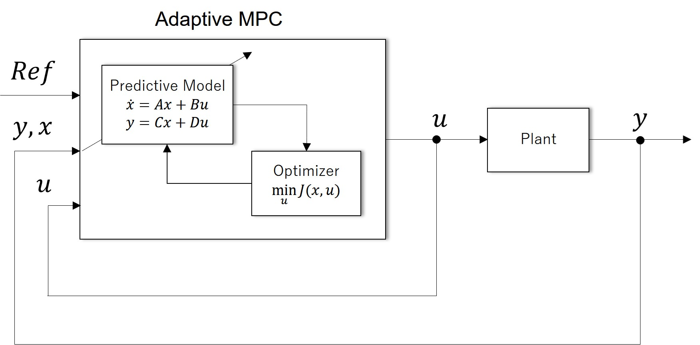
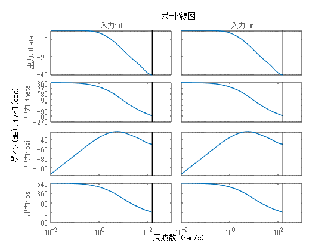
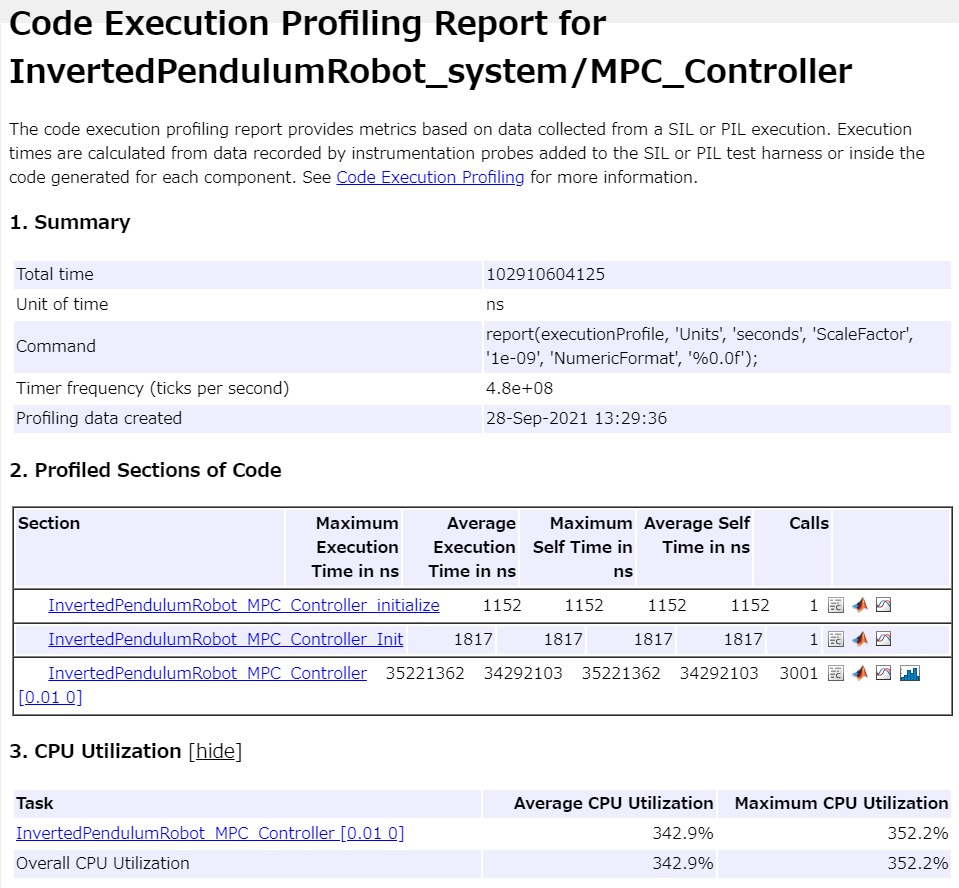
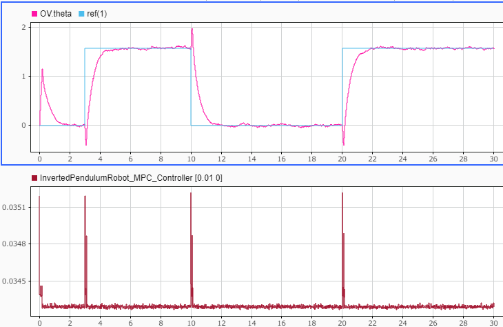
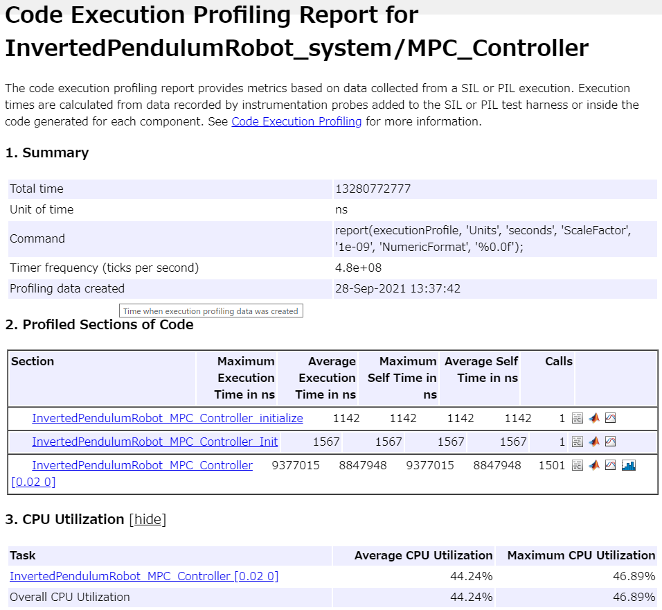
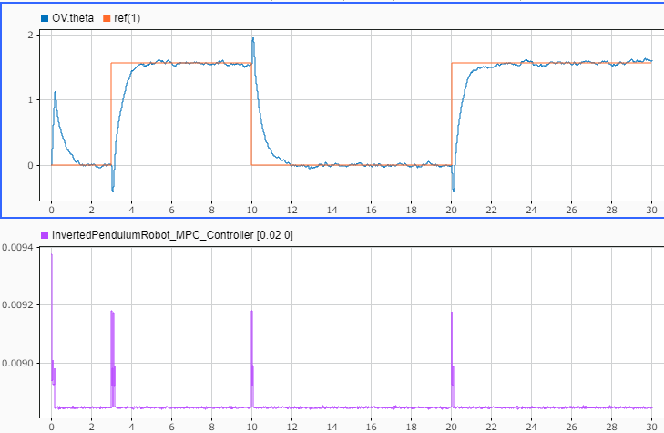

# 適応モデル予測制御による倒立制御走行ロボットの倒立制御

2輪型倒立振子に対し、適応モデル予測制御を利用して、倒立制御の設計を行う。


また、設計後のCコード生成、SIL、PILの例も合わせて紹介する。

# 初期化
```matlab
clc; Simulink.sdi.clear; Simulink.sdi.clearPreferences; Simulink.sdi.close;
proj = currentProject;
model_name = 'InvertedPendulumRobot_system';
ada_controller_name = 'InvertedPendulumRobot_MPC_Controller';
ts = get_TimeStep('InvertedPendulumRobot_data.sldd');

```
# プラントモデリング

プラントモデルをSimscape Multibodyを用いて構築した。モデルを開いて確認すること。タイヤとボディはRevolute Jointで繋ぎ、タイヤと地面の間は接触力のブロックで接続している。




# プラントモデルを定式化

倒立制御走行ロボットは以下のFig.1のような構成である。車両の正面方向をx軸、上方向をy軸とする。





Fig.1　2輪型倒立振子の概念図


 $\theta$ ：左右車輪の平均回転角度,  $\psi$ ：車体の傾斜角（ピッチ角）


横方向の運動（ヨー角）は今回は考慮しないものとする。


ラグランジュの運動方程式より、倒立振子ロボットの非線形運動モデルを算出する。

```matlab
% 変数定義
syms m M R Jw Jpsi fm fw L g K real;
syms theta_ddot theta_dot theta psi_ddot psi_dot psi real;
syms F_theta Fl Fr ir il real;
```

運動エネルギー $T$ を定義する。

```matlab
% タイヤの回転運動
Twr = 0.5*Jw*(theta_dot+psi_dot)^2;

% ボディの回転運動
TBr = 0.5*Jpsi*psi_dot^2;

% タイヤの並進運動
Twh = 0.5*m*(R*(theta_dot+psi_dot))^2;

% ボディの並進運動
xc = R*(theta+psi); yc = 0;                                 % タイヤの中心座標
xp = xc + L*sin(psi); yp = yc + L*cos(psi);                 % ボディの中心座標
Vx = R*(theta_dot+psi_dot)+L*psi_dot*(cos(psi));            % ボディの中心の並進速度 
Vy = -L*psi_dot*sin(psi);    
TBt = 0.5*M*(Vx^2+Vy^2);

% 合計の運動エネルギー
T = Twr + TBr + Twh + TBt;
```

位置エネルギー $U$ を定義する。

```matlab
U = M*g*yp;
```

損失エネルギー $D$ を定義する。

```matlab
D = 0.5*fm*psi_dot^2 + 0.5*fw*theta_dot^2;
```

一般化座標を定義する。

```matlab
q = [theta;psi];                % 位置
dq = [theta_dot;psi_dot];       % 速度
ddq = [theta_ddot;psi_ddot];    % 加速度
```

一般化力を定義する。

```matlab
f = [F_theta;0];
```

ラグランジアンLを定義する。

```matlab
L = T - U;
```

ラグランジュの運動方程式は以下の(1)式である。


 $\frac{d}{\textrm{dt}}\left(\frac{\partial }{\partial \dot{x} }T\right)+\frac{\partial }{\partial \dot{x} }D+\frac{\partial }{\partial x}U=0$                                (1)


ここで、(1)式の左辺を導出する。

```matlab
N = length(q);
for i = 1:N
  dLq(i)  = diff(L,dq(i));  %dL/dqdot
  
  % d/dt(dL/dqdot)
  temp = 0;
  for j = 1:N
    temp = temp + diff(dLq(i),dq(j))*ddq(j) ...
                + diff(dLq(i),q(j))*dq(j);
  end
  ddLq(i) = temp;
  
  % d/dt(dL/dqdot) - dL/dqdot + dD/dqdot = f
  eq(i) = ddLq(i) - diff(L,q(i)) ...
        + diff(D,dq(i)) - f(i);
end

eq = simplify(eq');
eq = collect(eq,[theta_ddot, psi_ddot, theta_dot, psi_dot])
```
eq = 
 $\displaystyle \begin{array}{l} \left(\begin{array}{cc} {\left(\textrm{Jw}+M\,R^2 +R^2 \,m\right)}\,\ddot{\theta} +{\left(\textrm{Jw}+R^2 \,m+M\,R\,{\left(R+L\,\cos \left(\psi \right)\right)}\right)}\,\ddot{\psi} +\textrm{fw}\,\dot{\theta} +\sigma_1 -F_{\theta }  & {\left(\textrm{Jw}+M\,R^2 +R^2 \,m+L\,M\,R\,\cos \left(\psi \right)\right)}\,\ddot{\theta} +{\left(\textrm{Jpsi}+\textrm{Jw}+L^2 \,M+M\,R^2 +R^2 \,m+2\,L\,M\,R\,\cos \left(\psi \right)\right)}\,\ddot{\psi} +\sigma_1 +\textrm{fm}\,\dot{\psi} -L\,M\,g\,\sin \left(\psi \right) \end{array}\right)\\\mathrm{}\\\textrm{where}\\\mathrm{}\\\;\;\sigma_1 ={\left(-L\,M\,R\,\sin \left(\psi \right)\right)}\,{\dot{\psi} }^2 \end{array}$
 

次に、アクチュエータ部分の定式化を行う。ここでは簡単化のため、制御器の操作量（電流指令値）に比例してトルクが発生するものとする。


上記で求めた運動方程式に代入する。

```matlab
X = [theta_ddot; psi_ddot];
Fl = K * il; 
Fr = K * ir;
eq = subs(eq,F_theta,Fl+Fr);
```

状態空間モデルに帰着させるために、theta\_ddotとpsi\_ddotについて解く。

```matlab
nl_sol = solve(eq,X);
fcn = [nl_sol.theta_ddot;
       nl_sol.psi_ddot]
```
fcn = 
 $\displaystyle \begin{array}{l} \left(\begin{array}{c} \frac{\textrm{Jpsi}\,K\,\textrm{il}+\textrm{Jpsi}\,K\,\textrm{ir}+\textrm{Jw}\,K\,\textrm{il}+\textrm{Jw}\,K\,\textrm{ir}+\textrm{Jw}\,\textrm{fm}\,\dot{\psi} -\textrm{Jpsi}\,\textrm{fw}\,\dot{\theta} -\textrm{Jw}\,\textrm{fw}\,\dot{\theta} +K\,L^2 \,M\,\textrm{il}+K\,L^2 \,M\,\textrm{ir}+\sigma_{11} +\sigma_{10} +\sigma_9 +\sigma_8 -L^2 \,M\,\textrm{fw}\,\dot{\theta} +\sigma_7 -\sigma_6 +\sigma_{13} -\sigma_{12} -\sigma_3 -\sigma_5 +L^3 \,M^2 \,R\,{\dot{\psi} }^2 \,\sin \left(\psi \right)-L^2 \,M^2 \,R\,g\,\cos \left(\psi \right)\,\sin \left(\psi \right)+\textrm{Jpsi}\,L\,M\,R\,{\dot{\psi} }^2 \,\sin \left(\psi \right)-\sigma_4 +2\,K\,L\,M\,R\,\textrm{il}\,\cos \left(\psi \right)+2\,K\,L\,M\,R\,\textrm{ir}\,\cos \left(\psi \right)+\sigma_2 +L\,M\,R\,\textrm{fm}\,\dot{\psi} \,\cos \left(\psi \right)-2\,L\,M\,R\,\textrm{fw}\,\dot{\theta} \,\cos \left(\psi \right)}{\sigma_1 }\newline -\frac{\textrm{Jw}\,K\,\textrm{il}+\textrm{Jw}\,K\,\textrm{ir}+\textrm{Jw}\,\textrm{fm}\,\dot{\psi} -\textrm{Jw}\,\textrm{fw}\,\dot{\theta} +\sigma_{11} +\sigma_{10} +\sigma_9 +\sigma_8 +\sigma_7 -\sigma_6 +\sigma_{13} -\sigma_{12} -\sigma_3 -\sigma_5 -\sigma_4 +K\,L\,M\,R\,\textrm{il}\,\cos \left(\psi \right)+K\,L\,M\,R\,\textrm{ir}\,\cos \left(\psi \right)+\sigma_2 -L\,M\,R\,\textrm{fw}\,\dot{\theta} \,\cos \left(\psi \right)}{\sigma_1 } \end{array}\right)\\\mathrm{}\\\textrm{where}\\\mathrm{}\\\;\;\sigma_1 =-L^2 \,M^2 \,R^2 \,{\cos \left(\psi \right)}^2 +L^2 \,M^2 \,R^2 +m\,L^2 \,M\,R^2 +\textrm{Jw}\,L^2 \,M+\textrm{Jpsi}\,M\,R^2 +\textrm{Jpsi}\,m\,R^2 +\textrm{Jpsi}\,\textrm{Jw}\\\mathrm{}\\\;\;\sigma_2 =L^2 \,M^2 \,R^2 \,{\dot{\psi} }^2 \,\cos \left(\psi \right)\,\sin \left(\psi \right)\\\mathrm{}\\\;\;\sigma_3 =L\,M^2 \,R^2 \,g\,\sin \left(\psi \right)\\\mathrm{}\\\;\;\sigma_4 =L\,M\,R^2 \,g\,m\,\sin \left(\psi \right)\\\mathrm{}\\\;\;\sigma_5 =\textrm{Jw}\,L\,M\,g\,\sin \left(\psi \right)\\\mathrm{}\\\;\;\sigma_6 =M\,R^2 \,\textrm{fw}\,\dot{\theta} \\\mathrm{}\\\;\;\sigma_7 =M\,R^2 \,\textrm{fm}\,\dot{\psi} \\\mathrm{}\\\;\;\sigma_8 =K\,R^2 \,\textrm{ir}\,m\\\mathrm{}\\\;\;\sigma_9 =K\,R^2 \,\textrm{il}\,m\\\mathrm{}\\\;\;\sigma_{10} =K\,M\,R^2 \,\textrm{ir}\\\mathrm{}\\\;\;\sigma_{11} =K\,M\,R^2 \,\textrm{il}\\\mathrm{}\\\;\;\sigma_{12} =R^2 \,\textrm{fw}\,m\,\dot{\theta} \\\mathrm{}\\\;\;\sigma_{13} =R^2 \,\textrm{fm}\,m\,\dot{\psi} \end{array}$
 

得られた計算式をMATLABコード生成する。

```matlab
file_path = [char(proj.RootFolder), filesep, 'gen_script', filesep, 'nlStateFcn.m'];
matlabFunction(fcn, 'File', file_path);
```
# Adaptive MPC のための線形近似システムの導出

Adaptive MPCは、非線形モデルを逐次線形化してモデル予測制御を行っている。そこで、非線形方程式の線形化を行い、状態空間モデルに帰着させる。


状態X、入力U、出力Y

```matlab
X = [theta; psi; theta_dot; psi_dot];
U = [il; ir];
Y = [theta; psi];
```

非線形の状態方程式

```matlab
nlstate = [theta_dot;
           psi_dot;
           fcn];
```

線形近似の係数行列を導出する。

```matlab
Ac = jacobian(nlstate,X)
```
Ac = 
 $\displaystyle \begin{array}{l} \left(\begin{array}{cccc} 0 & 0 & 1 & 0\newline 0 & 0 & 0 & 1\newline 0 & -\frac{\sigma_6 -\sigma_4 +\sigma_3 +\sigma_{18} +L^2 \,M^2 \,R\,g\,{\cos \left(\psi \right)}^2 -L^3 \,M^2 \,R\,{\dot{\psi} }^2 \,\cos \left(\psi \right)-L^2 \,M^2 \,R\,g\,{\sin \left(\psi \right)}^2 +L\,M\,R\,\textrm{fm}\,\dot{\psi} \,\sin \left(\psi \right)-2\,L\,M\,R\,\textrm{fw}\,\dot{\theta} \,\sin \left(\psi \right)-\textrm{Jpsi}\,L\,M\,R\,{\dot{\psi} }^2 \,\cos \left(\psi \right)+\sigma_8 +2\,K\,L\,M\,R\,\textrm{il}\,\sin \left(\psi \right)+2\,K\,L\,M\,R\,\textrm{ir}\,\sin \left(\psi \right)}{\sigma_1 }-\frac{2\,L^2 \,M^2 \,R^2 \,\cos \left(\psi \right)\,\sin \left(\psi \right)\,{\left(\textrm{Jpsi}\,K\,\textrm{il}+\textrm{Jpsi}\,K\,\textrm{ir}+\textrm{Jw}\,K\,\textrm{il}+\textrm{Jw}\,K\,\textrm{ir}+\textrm{Jw}\,\textrm{fm}\,\dot{\psi} -\textrm{Jpsi}\,\textrm{fw}\,\dot{\theta} -\textrm{Jw}\,\textrm{fw}\,\dot{\theta} +K\,L^2 \,M\,\textrm{il}+K\,L^2 \,M\,\textrm{ir}+\sigma_{14} +\sigma_{13} +\sigma_{12} +\sigma_{11} -L^2 \,M\,\textrm{fw}\,\dot{\theta} +\sigma_{10} -\sigma_9 +\sigma_{20} -\sigma_{19} -\sigma_5 -\sigma_{17} +L^3 \,M^2 \,R\,{\dot{\psi} }^2 \,\sin \left(\psi \right)-L^2 \,M^2 \,R\,g\,\cos \left(\psi \right)\,\sin \left(\psi \right)+\textrm{Jpsi}\,L\,M\,R\,{\dot{\psi} }^2 \,\sin \left(\psi \right)-\sigma_7 +2\,K\,L\,M\,R\,\textrm{il}\,\cos \left(\psi \right)+2\,K\,L\,M\,R\,\textrm{ir}\,\cos \left(\psi \right)+\sigma_2 +L\,M\,R\,\textrm{fm}\,\dot{\psi} \,\cos \left(\psi \right)-2\,L\,M\,R\,\textrm{fw}\,\dot{\theta} \,\cos \left(\psi \right)\right)}}{{\sigma_1 }^2 } & -\frac{\textrm{Jpsi}\,\textrm{fw}+\textrm{Jw}\,\textrm{fw}+L^2 \,M\,\textrm{fw}+\sigma_{16} +\sigma_{15} +2\,L\,M\,R\,\textrm{fw}\,\cos \left(\psi \right)}{\sigma_1 } & \frac{\textrm{Jw}\,\textrm{fm}+M\,R^2 \,\textrm{fm}+R^2 \,\textrm{fm}\,m+2\,L^3 \,M^2 \,R\,\dot{\psi} \,\sin \left(\psi \right)+L\,M\,R\,\textrm{fm}\,\cos \left(\psi \right)+2\,L^2 \,M^2 \,R^2 \,\dot{\psi} \,\cos \left(\psi \right)\,\sin \left(\psi \right)+2\,\textrm{Jpsi}\,L\,M\,R\,\dot{\psi} \,\sin \left(\psi \right)}{\sigma_1 }\newline 0 & \frac{\sigma_6 -\sigma_4 +\sigma_3 +\sigma_{18} -L\,M\,R\,\textrm{fw}\,\dot{\theta} \,\sin \left(\psi \right)+\sigma_8 +K\,L\,M\,R\,\textrm{il}\,\sin \left(\psi \right)+K\,L\,M\,R\,\textrm{ir}\,\sin \left(\psi \right)}{\sigma_1 }+\frac{2\,L^2 \,M^2 \,R^2 \,\cos \left(\psi \right)\,\sin \left(\psi \right)\,{\left(\textrm{Jw}\,K\,\textrm{il}+\textrm{Jw}\,K\,\textrm{ir}+\textrm{Jw}\,\textrm{fm}\,\dot{\psi} -\textrm{Jw}\,\textrm{fw}\,\dot{\theta} +\sigma_{14} +\sigma_{13} +\sigma_{12} +\sigma_{11} +\sigma_{10} -\sigma_9 +\sigma_{20} -\sigma_{19} -\sigma_5 -\sigma_{17} -\sigma_7 +K\,L\,M\,R\,\textrm{il}\,\cos \left(\psi \right)+K\,L\,M\,R\,\textrm{ir}\,\cos \left(\psi \right)+\sigma_2 -L\,M\,R\,\textrm{fw}\,\dot{\theta} \,\cos \left(\psi \right)\right)}}{{\sigma_1 }^2 } & \frac{\textrm{Jw}\,\textrm{fw}+\sigma_{16} +\sigma_{15} +L\,M\,R\,\textrm{fw}\,\cos \left(\psi \right)}{\sigma_1 } & -\frac{2\,\dot{\psi} \,\cos \left(\psi \right)\,\sin \left(\psi \right)\,L^2 \,M^2 \,R^2 +\textrm{fm}\,M\,R^2 +\textrm{fm}\,m\,R^2 +\textrm{Jw}\,\textrm{fm}}{\sigma_1 } \end{array}\right)\\\mathrm{}\\\textrm{where}\\\mathrm{}\\\;\;\sigma_1 =-L^2 \,M^2 \,R^2 \,{\cos \left(\psi \right)}^2 +L^2 \,M^2 \,R^2 +m\,L^2 \,M\,R^2 +\textrm{Jw}\,L^2 \,M+\textrm{Jpsi}\,M\,R^2 +\textrm{Jpsi}\,m\,R^2 +\textrm{Jpsi}\,\textrm{Jw}\\\mathrm{}\\\;\;\sigma_2 =L^2 \,M^2 \,R^2 \,{\dot{\psi} }^2 \,\cos \left(\psi \right)\,\sin \left(\psi \right)\\\mathrm{}\\\;\;\sigma_3 =L^2 \,M^2 \,R^2 \,{\dot{\psi} }^2 \,{\sin \left(\psi \right)}^2 \\\mathrm{}\\\;\;\sigma_4 =L^2 \,M^2 \,R^2 \,{\dot{\psi} }^2 \,{\cos \left(\psi \right)}^2 \\\mathrm{}\\\;\;\sigma_5 =L\,M^2 \,R^2 \,g\,\sin \left(\psi \right)\\\mathrm{}\\\;\;\sigma_6 =L\,M^2 \,R^2 \,g\,\cos \left(\psi \right)\\\mathrm{}\\\;\;\sigma_7 =L\,M\,R^2 \,g\,m\,\sin \left(\psi \right)\\\mathrm{}\\\;\;\sigma_8 =L\,M\,R^2 \,g\,m\,\cos \left(\psi \right)\\\mathrm{}\\\;\;\sigma_9 =M\,R^2 \,\textrm{fw}\,\dot{\theta} \\\mathrm{}\\\;\;\sigma_{10} =M\,R^2 \,\textrm{fm}\,\dot{\psi} \\\mathrm{}\\\;\;\sigma_{11} =K\,R^2 \,\textrm{ir}\,m\\\mathrm{}\\\;\;\sigma_{12} =K\,R^2 \,\textrm{il}\,m\\\mathrm{}\\\;\;\sigma_{13} =K\,M\,R^2 \,\textrm{ir}\\\mathrm{}\\\;\;\sigma_{14} =K\,M\,R^2 \,\textrm{il}\\\mathrm{}\\\;\;\sigma_{15} =R^2 \,\textrm{fw}\,m\\\mathrm{}\\\;\;\sigma_{16} =M\,R^2 \,\textrm{fw}\\\mathrm{}\\\;\;\sigma_{17} =\textrm{Jw}\,L\,M\,g\,\sin \left(\psi \right)\\\mathrm{}\\\;\;\sigma_{18} =\textrm{Jw}\,L\,M\,g\,\cos \left(\psi \right)\\\mathrm{}\\\;\;\sigma_{19} =R^2 \,\textrm{fw}\,m\,\dot{\theta} \\\mathrm{}\\\;\;\sigma_{20} =R^2 \,\textrm{fm}\,m\,\dot{\psi} \end{array}$
 

```matlab
Bc = jacobian(nlstate,U)
```
Bc = 
 $\displaystyle \begin{array}{l} \left(\begin{array}{cc} 0 & 0\newline 0 & 0\newline \sigma_1  & \sigma_1 \newline \sigma_2  & \sigma_2  \end{array}\right)\\\mathrm{}\\\textrm{where}\\\mathrm{}\\\;\;\sigma_1 =\frac{\textrm{Jpsi}\,K+\textrm{Jw}\,K+K\,L^2 \,M+K\,M\,R^2 +K\,R^2 \,m+2\,K\,L\,M\,R\,\cos \left(\psi \right)}{\sigma_3 }\\\mathrm{}\\\;\;\sigma_2 =-\frac{\textrm{Jw}\,K+K\,M\,R^2 +K\,R^2 \,m+K\,L\,M\,R\,\cos \left(\psi \right)}{\sigma_3 }\\\mathrm{}\\\;\;\sigma_3 =-L^2 \,M^2 \,R^2 \,{\cos \left(\psi \right)}^2 +L^2 \,M^2 \,R^2 +m\,L^2 \,M\,R^2 +\textrm{Jw}\,L^2 \,M+\textrm{Jpsi}\,M\,R^2 +\textrm{Jpsi}\,m\,R^2 +\textrm{Jpsi}\,\textrm{Jw}\end{array}$
 

```matlab
Cc = jacobian(Y,X)
```
Cc = 
 $\displaystyle \left(\begin{array}{cccc} 1 & 0 & 0 & 0\newline 0 & 1 & 0 & 0 \end{array}\right)$
 

得られた計算式をMATLABコード生成する。

```matlab
file_path = [char(proj.RootFolder), filesep, 'gen_script', filesep, 'calc_nlstate.m'];
matlabFunction(nlstate, 'File', file_path);
file_path = [char(proj.RootFolder), filesep, 'gen_script', filesep, 'calc_Ac.m'];
matlabFunction(Ac, 'File', file_path);
file_path = [char(proj.RootFolder), filesep, 'gen_script', filesep, 'calc_Bc.m'];
matlabFunction(Bc, 'File', file_path);
file_path = [char(proj.RootFolder), filesep, 'gen_script', filesep, 'calc_Cc.m'];
matlabFunction(Cc, 'File', file_path);
```
# プラントモデルのパラメーターを定義
```matlab
param.g = 9.81;                                 % 重力加速度 [m/sec2]
param.m = 0.03;                                 % 車輪質量 [kg]
param.R = 0.04;                                 % 車輪半径 [m]
param.Jw = param.m*param.R^2/2;                 % 車輪慣性モーメント [kgm2]
param.M = 0.6;                                  % 車体質量 [kg]
param.W = 0.14;                                 % 車体幅 [m]
param.D = 0.01;                                 % 車体奥行き [m]
param.H = 0.144;                                % 車体高さ [m]
param.L = param.H/2;                            % 車輪中心から車体重心までの距離 [m]
param.Jpsi = param.M*param.L^2/3;               % 車体慣性モーメント（ピッチ） [kgm2]
param.Jphi = param.M*(param.W^2+param.D^2)/12;  % 車体慣性モーメント（ヨー） [kgm2]
param.Kt = 0.317;                               % DCモータートルク定数 [Nm/A]
param.n = 1;                                    % ギアレシオ
param.K = param.Kt*param.n;                     % 電流からトルクへの変換係数
param.fm = 1e-4;                                % 車体とDCモーター間の摩擦係数
param.fw = 0.4;                                 % 車輪と路面間の摩擦係数
```
# Adaptive MPCコントローラーの設計

導出したプラントモデルの計算式を用いて、適応MPCを構成する。適応MPCは、以下のFig.2のようなブロック図で表現できる。





　　　　　　　　　　　Fig.2　制御系のブロック線図


MPCオブジェクトを定義する。


最初に係数行列と状態の初期化を行う必要がある。

```matlab
x0 = zeros(4,1);
u0 = zeros(2,1);

[~,~,Ac,Bc,Cc,Dc] = InvertedPendulumRobot_CT(x0, u0, param);
plant = ss(Ac,Bc,Cc,Dc);
state_names = {'theta', 'psi', 'theta_dot', 'psi_dot'};
output_names = {'theta', 'psi'};
input_names = {'il', 'ir'};
plant.InputName = input_names;
plant.StateName = state_names;
plant.OutputName = output_names;
plant
```

```matlabTextOutput
plant =
 
  A = 
                  theta        psi  theta_dot    psi_dot
   theta              0          0          1          0
   psi                0          0          0          1
   theta_dot          0       -904      -2669     0.2133
   psi_dot            0        338      853.2   -0.07976
 
  B = 
                  il      ir
   theta           0       0
   psi             0       0
   theta_dot    2116    2116
   psi_dot    -676.2  -676.2
 
  C = 
              theta        psi  theta_dot    psi_dot
   theta          1          0          0          0
   psi            0          1          0          0
 
  D = 
          il  ir
   theta   0   0
   psi     0   0
 
連続時間状態空間モデル。
```

MPCのオブジェクト作成とパラメータを定義する。

```matlab
% 予測ホライズン
PredictionHorizon = 60;
% 制御ホライズン
ControlHorizon = 2;

% オブジェクト作成
MPC_verbosity = mpcverbosity('off');
mpcobj = mpc(c2d(plant,ts),ts,PredictionHorizon,ControlHorizon);

% 入力制約
mpcobj.MV(1).Max = 4;
mpcobj.MV(2).Max = 4;
mpcobj.MV(1).Min = -4;
mpcobj.MV(2).Min = -4;
% mpcobj.MV(1).RateMax = 1e-1;
% mpcobj.MV(2).RateMax = 1e-1;
% mpcobj.MV(1).RateMin = -1e-1;
% mpcobj.MV(2).RateMin = -1e-1;

% 出力（ピッチ角）に対する制約
mpcobj.OV(2).Max = 90*pi/180;
mpcobj.OV(2).Min = -90*pi/180;

% コスト関数の重み
mpcobj.Weights.OV = [10 10];
mpcobj.Weights.MVRate = [1 1];
mpcobj.Weights.ECR = 100;

% QPソルバーのアルゴリズムを選択
% mpcobj.Optimizer.Algorithm = 'interior-point';

% オブジェクトのチェック
% review(mpcobj)

% コントローラの初期状態
stateobj = mpcstate(mpcobj);
psi_0 = 10;
stateobj.plant = [0;psi_0*pi/180;0;0];
```
# 安定性の解析

構成したMPCの理論的な安定性を以下のように評価することができる。

```matlab
MPCss = ss(mpcobj);
clsys = feedback(c2d(plant,ts),MPCss,[1 2],[1 2],1);
eig(clsys)
```

```matlabTextOutput
ans = 11x1 complex    
   0.3215 + 0.3400i
   0.3215 - 0.3400i
   0.9496 + 0.0000i
   0.9802 + 0.0000i
   0.9778 + 0.0000i
   0.8659 + 0.0000i
   0.8725 + 0.0000i
   0.8726 + 0.0000i
1.0000 + 0.0000i
  -0.0000 + 0.0000i

```

```matlab
bode(clsys)
```


# シミュレーション

モデルを実行して動作を確認する。

```matlab
open_system(model_name);
set_param([model_name, '/MPC_Controller'], 'SimulationMode', 'Normal');
sim(model_name);
```

結果を表示する。

```matlab
plot_IPR_result_in_SDI;
```

合わせて、Mechanics Explorerに表示される3Dのモデルの動作も確認すること。

# コード生成

Embedded Coder®コード生成結果を確認する。

```matlab
return;
slbuild(ada_controller_name);
```
# SIL検証

SILモードでモデルとコードの等価性を調べる。

```matlab
return;
set_param([model_name, '/MPC_Controller'], 'SimulationMode', 'Normal');
sim(model_name);
set_param([model_name, '/MPC_Controller'], 'SimulationMode', 'Software-in-the-Loop (SIL)');
sim(model_name);
```

結果を比較する。

```matlab
compare_previous_run(1);
```
# PIL検証

本節では、例としてSTM32 Nucleo H743ZI2を用いたPIL検証を行う。STM32 Nucleo H743ZI2の性能は以下の通りである。

-  CPU: Coretex\-M7 
-  Clock: 400MHz 
-  Flash ROM: 2MB 
-  SRAM: 864kB 

PIL検証の手順は使用する環境に依存しているため、本節ではコードを用いた説明は行わない。以下の手順を参考に、各自の実装環境で行うこと。

1.  "InvertedPendulumRobot\_MPC\_Controller.slx"のコンフィギュレーションをPIL実行用の設定に変更する。参考までに、"InvertedPendulumRobot\_data.sldd"の中のコンフィギュレーション"controller\_config\_PIL"が、今回行ったPIL検証の設定である。
2. 参照モデル"MPC\_Controller"のシミュレーションモードを'Processor\-in\-the\-loop (PIL)'とする。または、"InvertedPendulumRobot\_MPC\_Controller.slx"をビルドし、PILブロックを生成し、"MPC\_Controller"と置き換える。
3. 参照モデルを用いる場合は、"InvertedPendulumRobot\_system.slx"の方のコンフィギュレーションも"タスク実行時間を計測する"にチェックを入れる必要がある。
4. モデル"InvertedPendulumRobot\_system.slx"を実行する。

実行の際には、事前にSTM32 Nucleo H743ZI2をUSBでPCに接続し、ポートの指定を正しく行うこと。


今回は以下のような結果が得られた。








1ステップ当たりの平均計算時間は34.3ms、CPU使用率は342.9%である。


ここで、予測ホライズンを30ステップ、サンプリングタイムステップを20msに変更する。この場合、予測区間の時間的長さは変更前と同一であり、制御の応答性能に影響がないことが確認できた。


変更後、PIL実行を行った結果、以下のようになった。








1ステップ当たりの平均計算時間は8.85ms、CPU使用率は44.24%である。

## 参考文献 :

1) 川田 昌克 編著ほか　倒立振子で学ぶ制御工学　森北出版


2) トランジスタ技術 2019年7月


