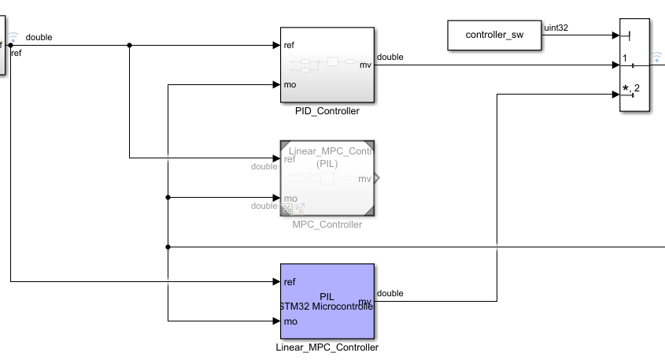
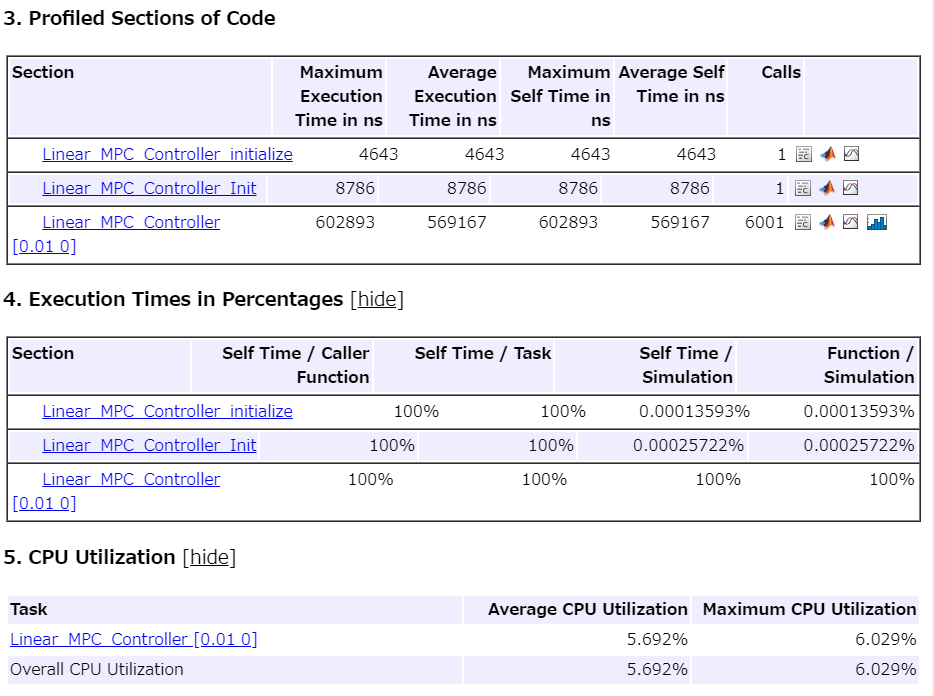
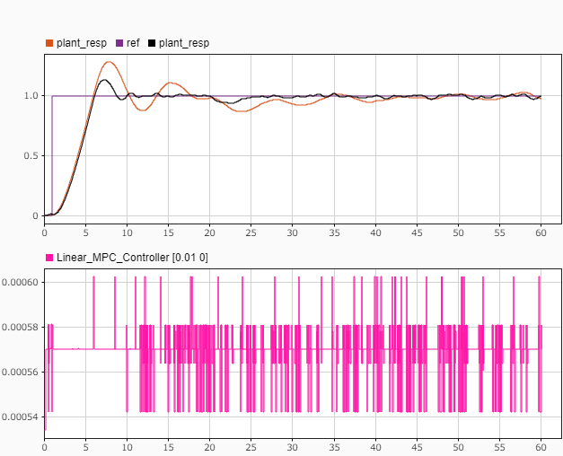
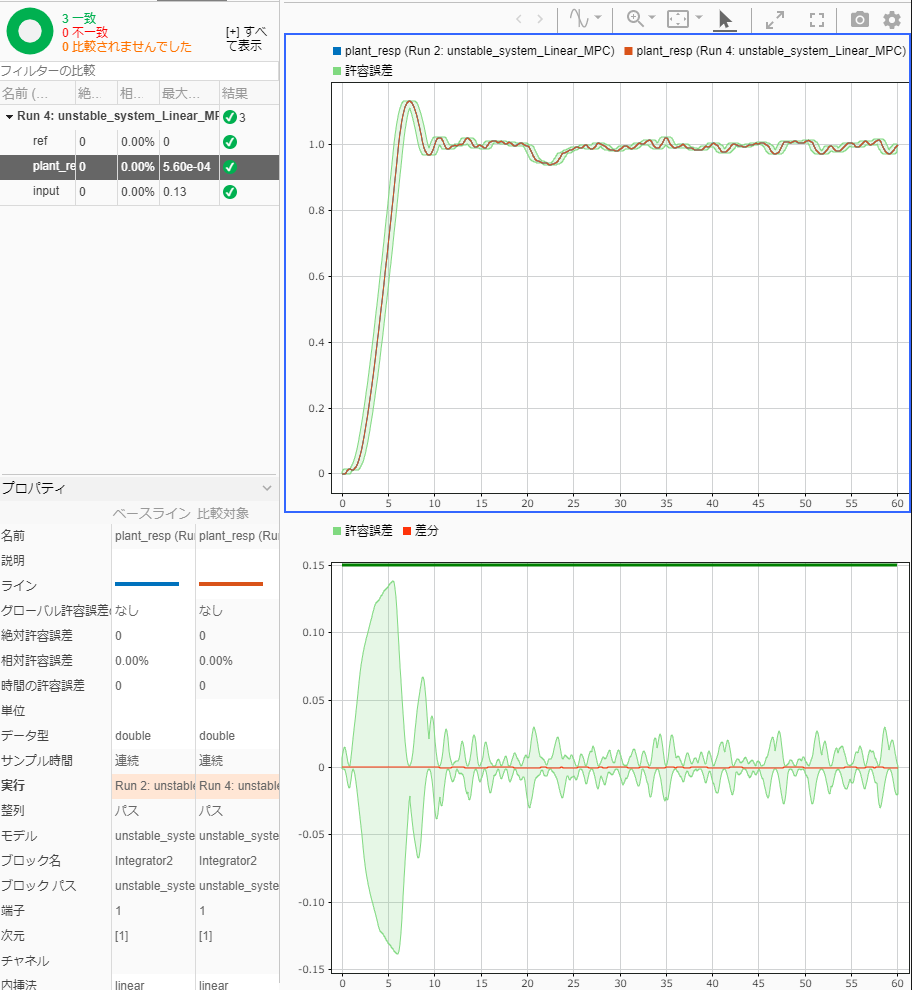

# 線形MPCコントローラの設計と実装

このサンプルでは、線形MPCを設計するブロック"MPC Controller"を用いた設計の例を示す。


また、設計後のCコード生成、SIL、PILの例も合わせて紹介する。

# 初期化
```matlab
clc; Simulink.sdi.clear; Simulink.sdi.clearPreferences; Simulink.sdi.close;
model_name = 'unstable_system_Linear_MPC';
lin_controller_name = 'Linear_MPC_Controller';
plant_model_name = 'Unstable_plant_model';
ts = get_TimeStep('sim_data_unstable_system.sldd');

```
# プラントモデルを定式化

プラントモデルを確認する。

```matlab
show_simulink_model(plant_model_name);
```


ベースの伝達関数「1.6/(2s + 1)s」に加えて、制御器の限界、オフセット外乱、システム雑音、観測雑音、センサーオフセット、計測むだ時間を含むシステムであるが、ここでは伝達関数、制御器の限界、計測むだ時間が既知であり、何らかのオフセット外乱が加わるものとして設計を進める。


伝達関数を離散の状態空間モデルにする。このとき、むだ時間も含めて設計を行う。

```matlab
plant_tf = tf(1.6, [2, 1, 0])
```

```matlabTextOutput
plant_tf =
 
1.6
  ---------
  2 s^2 + s
 
連続時間の伝達関数です。
```

```matlab
plant_tf_d = c2d(plant_tf, ts)
```

```matlabTextOutput
plant_tf_d =
 
  3.993e-05 z + 3.987e-05
  -----------------------
   z^2 - 1.995 z + 0.995
 
サンプル時間:  0.01 seconds
離散時間の伝達関数です。
```

```matlab
plant_tf_d_delay = tf(plant_tf_d.Numerator, plant_tf_d.Denominator, ts, 'OutputDelay', 20)
```

```matlabTextOutput
plant_tf_d_delay =
 
            3.993e-05 z + 3.987e-05
  z^(-20) * -----------------------
             z^2 - 1.995 z + 0.995
 
サンプル時間:  0.01 seconds
離散時間の伝達関数です。
```

```matlab
plant_ss = ss(plant_tf_d_delay)
```

```matlabTextOutput
plant_ss =
 
  A = 
           x1      x2
   x1   1.995  -0.995
   x2       1       0
 
  B = 
             u1
   x1  0.007812
   x2         0
 
  C = 
             x1        x2
   y1  0.005111  0.005103
 
  D = 
       u1
   y1   0
 
  出力遅延 (サンプル期間): 20 
 
サンプル時間:  0.01 seconds
離散時間状態空間モデル。
```

入力外乱は状態空間モデルの、本来の入力とは異なる入力として扱う。以下のように、外乱の状態空間モデルを元々のプラントモデルに結合する。

```matlab
B = [plant_ss.B, [1; 0]];
D = [plant_ss.D, 0];
plant_ss_indist = ss(plant_ss.A, B, plant_ss.C, D, ts, 'OutputDelay', 20)
```

```matlabTextOutput
plant_ss_indist =
 
  A = 
           x1      x2
   x1   1.995  -0.995
   x2       1       0
 
  B = 
             u1        u2
   x1  0.007812         1
   x2         0         0
 
  C = 
             x1        x2
   y1  0.005111  0.005103
 
  D = 
       u1  u2
   y1   0   0
 
  出力遅延 (サンプル期間): 20 
 
サンプル時間:  0.01 seconds
離散時間状態空間モデル。
```
# MPCオブジェクトを作る

入力外乱は計測できないものと想定する。よって、状態空間モデルの2番目の入力が「計測できない外乱」であるとするために、以下のように「setmpcsignals」を用いて指定する。

```matlab
plant_ss_indist = setmpcsignals(plant_ss_indist, 'MV', 1, 'UD', 2);
```

MPCオブジェクトを作成する。

```matlab
% mpcObj = mpc(plant_ss, ts)
mpcObj = mpc(plant_ss_indist, ts)
```

```matlabTextOutput
-->"PredictionHorizon" プロパティが空です。既定の 10 を仮定します。
-->"PredictionHorizon" プロパティ 10 が、モデルの最大遅延 20 より小さくなっています。より大きい予測ホライズン、たとえば 30 を選択してください。
-->"PredictionHorizon" プロパティがさらに 30 に増加されました。これはモデルに遅延が含まれているためです。
-->"ControlHorizon" プロパティが空です。既定の 2 を仮定します。
-->"Weights.ManipulatedVariables" プロパティが空です。既定の 0.00000 を仮定します。
-->"Weights.ManipulatedVariablesRate" プロパティが空です。既定の 0.10000 を仮定します。
-->"Weights.OutputVariables" プロパティが空です。既定の 1.00000 を仮定します。
 
MPC object (created on 15-Sep-2022 17:21:49):
---------------------------------------------
Sampling time:      0.01 (seconds)
Prediction Horizon: 30
Control Horizon:    2

Plant Model:        (max I/O delay = 20)
                                      --------------
      1  manipulated variable(s)   -->|  2 states  |
                                      |            |-->  1 measured output(s)
      0  measured disturbance(s)   -->|  2 inputs  |
                                      |            |-->  0 unmeasured output(s)
      1  unmeasured disturbance(s) -->|  1 outputs |
                                      --------------
Indices:
  (input vector)    Manipulated variables: [1 ]
                  Unmeasured disturbances: [2 ]
  (output vector)        Measured outputs: [1 ]

Disturbance and Noise Models:
        Output disturbance model: default (type "getoutdist(mpcObj)" for details)
         Input disturbance model: default (type "getindist(mpcObj)" for details)
         Measurement noise model: default (unity gain after scaling)

Weights:
        ManipulatedVariables: 0
    ManipulatedVariablesRate: 0.1000
             OutputVariables: 1
                         ECR: 100000

State Estimation:  Default Kalman Filter (type "getEstimator(mpcObj)" for details)

Unconstrained
```

制御器の限界が分かっているために、「ManipulatedVariables」の上下限を指令することができる。

```matlab
mpcObj.ManipulatedVariables(1).Max = 0.2;
mpcObj.ManipulatedVariables(1).Min = -0.2;
```

予測ホライズンと制御ホライズンを指定する。

```matlab
mpcObj.PredictionHorizon = 32;
mpcObj.ControlHorizon = 1;
```

パラメータのチューニングを行う。チューニングを行うと、MPCオブジェクトの以下の項目が調整される。調整後のパラメータを以下のようにコマンドで指定することで、過去に調整した結果を再現することができる。

```matlab
dist_model = ss(1, 9.120108393559096e-04, 1, 0, ts);
mpcObj.Model.Disturbance = dist_model;
noise_model = ss(0, 0, 0, 10.964781961431852, ts);
mpcObj.Model.Noise = noise_model;
mpcObj.Weights.ManipulatedVariablesRate = 0.001831563888873;
mpcObj.Weights.OutputVariables = 54.598150033144240;
```
# シミュレーション

モデルを実行して動作を確認する。

```matlab
open_system(model_name);

% 参照モデルをノーマルモードにセット
set_param([model_name, '/MPC_Controller'], 'SimulationMode', 'Normal');
% マニュアルスイッチをPID側にセット
controller_sw = 1;

% set_param(model_name, 'SimulationCommand', 'update');
```

「controller\_sw」で制御方式を切り替えられるようにしている。


ここではPID制御とMPC制御の比較を行う。PID制御の方も適度にチューニングされており、制御器の限界を考慮してアンチワインドアップも設定している。両者共に最大限に応答速度を高めている。

```matlab
sim(model_name);
```

```matlabTextOutput
-->遅延を状態に変換します。
   測定出力チャネル #1 に外乱が追加されていないと仮定します。
```

```matlab
controller_sw = 2;
sim(model_name);
```

結果をシミュレーションデータインスペクターに表示する。

```matlab
plot_unstable_system_result_in_SDI;
```

モデル予測制御の方が応答の性能が良いことがわかる。制御器の限界を陽に考慮したアルゴリズムである点、また、むだ時間を考慮した点で、PIDを上回る性能を発揮したと考えられる。

# コード生成

Embedded Coder®によるコード生成結果を確認する。

```matlab
return;
slbuild(lin_controller_name);
```
# SIL検証

SILモードでモデルとコードの等価性を調べる。

```matlab
return;
set_param([model_name, '/MPC_Controller'], 'SimulationMode', 'Normal');
sim(model_name);
set_param([model_name, '/MPC_Controller'], 'SimulationMode', 'Software-in-the-Loop (SIL)');
sim(model_name);
```

結果を比較する。

```matlab
compare_previous_run(1);
```

計算結果は必ずしも一致するわけではない。アルゴリズムの計算は浮動小数点で行われているため、例えば四則演算の計算順序が変わると結果が僅かに異なる場合がある。コード生成前後で四則演算の順序は変わる可能性がある。

# PIL検証

本節では、例としてSTM32 Nucleo F401REを用いたPIL検証を行う。STM32 Nucleo F401REの性能は以下の通りである。

-  CPU: Coretex\-M4F 
-  Clock: 84MHz 
-  Flash ROM: 512kB 
-  SRAM: 96kB 

PIL検証の手順は使用する環境に依存しているため、本節ではコードを用いた説明は行わない。以下の手順を参考に、各自の実装環境で行うこと。

1.  "Linear\_MPC\_Controller.slx"のコンフィギュレーションをPIL実行用の設定に変更する。参考までに、"sim\_data\_unstable\_system.sldd"の中のコンフィギュレーション"controller\_config\_PIL"が、今回行ったPIL検証の設定である。
2. 参照モデル"MPC\_Controller"のシミュレーションモードを'Processor\-in\-the\-loop (PIL)'とする。または、"Linear\_MPC\_Controller.slx"をビルドし、PILブロックを生成し、"MPC\_Controller"と置き換える。（以下の図を参照）
3. 参照モデルを用いる場合は、"unstable\_system\_Linear\_MPC.slx"の方のコンフィギュレーションも"タスク実行時間を計測する"にチェックを入れる必要がある。
4. モデル"unstable\_system\_Linear\_MPC.slx"を実行する。




実行の際には、事前にSTM32 Nucleo F401REをUSBでPCに接続し、ポートの指定を正しく行うこと。


今回は以下のような結果が得られた。








1ステップ当たりの平均計算時間は569μs、CPU使用率は5.69%である。


モデルとコードの実行の比較結果は以下のようになった。





