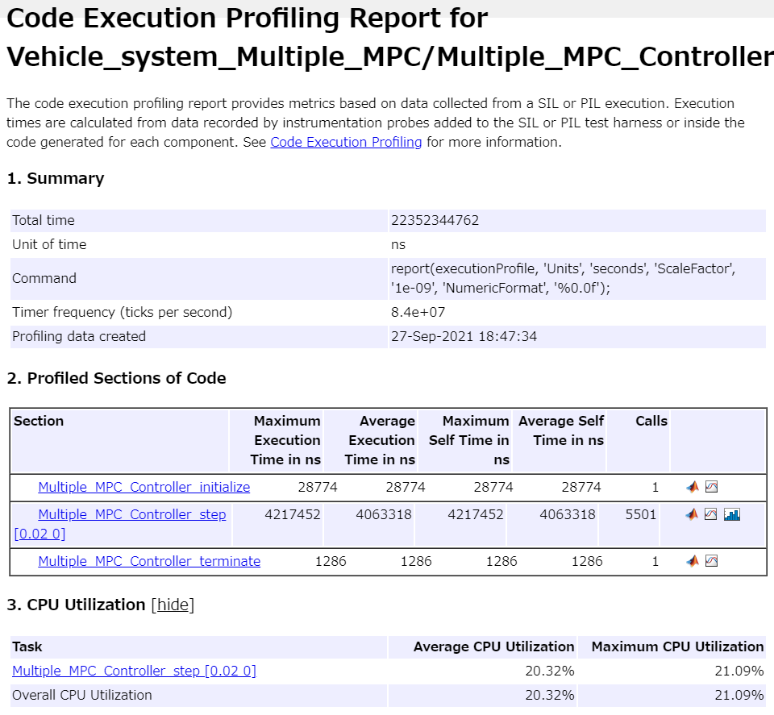
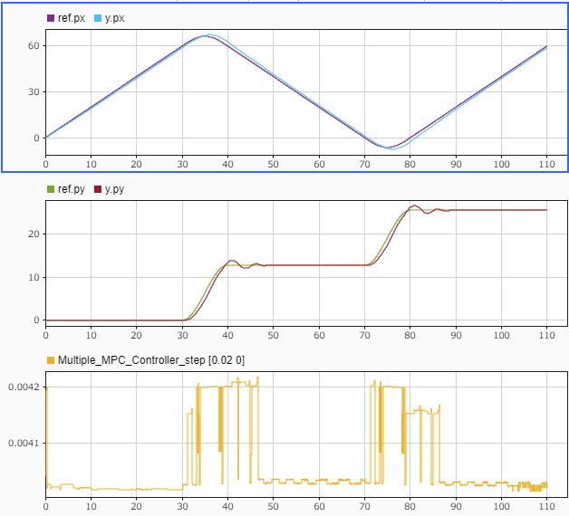

# ゲインスケジュールMPCコントローラの設計と実装


このサンプルでは、複数動作点で切り替える線形MPCを設計するブロック"Multiple MPC Controller"を用いた設計の例を示す。


また、設計後のCコード生成、SIL、PILの例も合わせて紹介する。


# 初期化

```matlab:Code
clc; Simulink.sdi.clear; Simulink.sdi.clearPreferences; Simulink.sdi.close;
proj = currentProject;
model_name = 'Vehicle_system_Multiple_MPC';
mul_controller_name = 'Multiple_MPC_Controller';
standalone_plant_name = 'Vehicle_plant_model_sl';
ts = get_TimeStep('sim_data_vehicle.sldd');

```

# プラントモデルを定式化
# 状態空間表現


適応MPCと同一であるため、説明は省略する。詳細については「Adaptive_MPC_Design.mlx」を参照。


```matlab:Code
% 変数定義
syms m u v r F_f F_r real;
syms I l_f l_r v_dot r_dot V beta beta_dot real;
% 方程式
eq_1 = m * (v_dot + u * r) == F_f + F_r;
eq_2 = I * r_dot == l_f * F_f - l_r * F_r;
% 代入
eq_1 = subs(eq_1, [u, v_dot], [V, V * beta_dot]);
% 変数定義
syms K_f K_r delta beta_f beta_r real;
% 代入
eq_vec = subs([eq_1, eq_2], [F_f, F_r], [-2 * K_f * beta_f, -2 * K_r * beta_r]);
eq_vec = subs(eq_vec, [beta_f, beta_r], ...
    [beta + (l_f / V) * r - delta, beta - (l_r / V) * r]);
eq_1 = eq_vec(1);
eq_2 = eq_vec(2);
sol_vec = solve([eq_1, eq_2], [beta_dot, r_dot]);
beta_dot = sol_vec.beta_dot;
r_dot = sol_vec.r_dot;

normal_input_names = {'delta', 'a'};
% 変数定義
syms a real;
U = [delta; a];
state_names = {'px', 'py', 'theta', 'r', 'beta', 'V'};
% 変数定義
syms theta px py real;
X = [px; py; theta; r; beta; V];
output_names = {'px', 'py', 'theta', 'r', 'V'};
Y = [px; py; theta; r; V];
f = [ ...
    V * cos(theta);
    V * sin(theta);
    r;
    sol_vec.r_dot;
    sol_vec.beta_dot;
    a;
    ];
h = [X(1); X(2); X(3); X(4); X(6)];
file_path = [char(proj.RootFolder), filesep, 'gen_script', filesep, 'calc_nonlinear_f.m'];
matlabFunction(f, 'File', file_path);
insert_zero_divide_avoidance(file_path);
file_path = [char(proj.RootFolder), filesep, 'gen_script', filesep, 'calc_nonlinear_h.m'];
matlabFunction(h, 'File', file_path);
insert_zero_divide_avoidance(file_path);
```

# MPCのための定式化


Multiple MPCは、非線形モデルを動作点ごとに線形化し、それぞれの動作点周りで線形モデル予測制御を行っている。ここでは、"linearize"というコマンドを用いて、それぞれの動作点周りの微小変化から線形近似を行う。


動作点として、とにおける以下のパターンの組み合わせを取る。その他の状態、入力はすべて0とする。


この場合、以下の8通りの動作点が存在することになる。


```matlab:Code
op_pattern = [{[0; 1]}; {[0; 2]};
    {[pi/2; 1]}; {[pi/2; 2]};
    {[pi; 1]}; {[pi; 2]};
    {[-pi/2; 1]}; {[-pi/2; 2]};
    ];
```


各動作点周りで状態方程式を線形化する。


```matlab:Code
% パラメータ
m_val = 2000;
l_f_val = 1.4;
l_r_val = 1.6;
I_val = 4000;
K_f_val = 12e3;
K_r_val = 11e3;

% 初期状態
x0 = [0; 0; 0; 0; 0; 1];

% 線形化したいシステムの入力と出力を指定
lin_io(1) = linio([standalone_plant_name, '/Vehicle_plant_model/input'], 1,'input');
lin_io(2) = linio([standalone_plant_name, '/Vehicle_plant_model/output_eq'], 1,'openoutput');

sys_pattern = cell(1, numel(op_pattern));
for i = 1:numel(op_pattern)

    x0(3) = op_pattern{i}(1, 1);
    x0(6) = op_pattern{i}(2, 1);
    
    sys_pattern{i} = linearize(standalone_plant_name, lin_io);

    sys_pattern{i}.InputName = normal_input_names;
    sys_pattern{i}.StateName = state_names;
    sys_pattern{i}.OutputName = output_names;
end
sys_pattern
```

| |1|2|3|4|5|6|7|8|
|:--:|:--:|:--:|:--:|:--:|:--:|:--:|:--:|:--:|
|1|5x2 ss|5x2 ss|5x2 ss|5x2 ss|5x2 ss|5x2 ss|5x2 ss|5x2 ss|


Multiple MPCに与えるMPCオブジェクトを各動作点で作成する。


```matlab:Code
yNum_MPC = size(Y, 1);
mpcverbosity('off');

mpcObj_multi = cell(1, numel(op_pattern));
for i = 1:numel(op_pattern)
    mpcObj_multi{i} = mpc(sys_pattern{i});
    
    % 予測ホライズン、制御ホライズンの設定
    mpcObj_multi{i}.PredictionHorizon = 32;
    mpcObj_multi{i}.ControlHorizon = 1;
    
    % 制約
    % 操舵角は30deg以内であること
    delta_limit = 30;
    mpcObj_multi{i}.ManipulatedVariables(1).Max = delta_limit * pi / 180;
    mpcObj_multi{i}.ManipulatedVariables(1).Min = -delta_limit * pi / 180;
    % 加速度は2m/s^2以内であること
    acc_limit = 2;
    mpcObj_multi{i}.ManipulatedVariables(2).Max = acc_limit;
    mpcObj_multi{i}.ManipulatedVariables(2).Min = -acc_limit;
    
    % ノミナル状態を設定
    mpcObj_multi{i}.Model.Nominal.X = [0, 0, 0, 0, 0, 1];
    
    % 最適化の重みを設定
    mpcObj_multi{i}.Weights.OutputVariables = [1, 1, 0, 0, 1];
    mpcObj_multi{i}.Weights.ManipulatedVariables = [0.1, 0.1];
    mpcObj_multi{i}.Weights.ManipulatedVariablesRate = [0.0, 0.0];
    
end

mpcObj_multi
```

| |1|2|3|4|5|6|7|8|
|:--:|:--:|:--:|:--:|:--:|:--:|:--:|:--:|:--:|
|1|2x5 mpc|2x5 mpc|2x5 mpc|2x5 mpc|2x5 mpc|2x5 mpc|2x5 mpc|2x5 mpc|


```matlab:Code
% 初期状態 (Multiple MPC Controller用)
x0_multi = cell(1, numel(op_pattern))
```

| |1|2|3|4|5|6|7|8|
|:--:|:--:|:--:|:--:|:--:|:--:|:--:|:--:|:--:|
|1|[ ]|[ ]|[ ]|[ ]|[ ]|[ ]|[ ]|[ ]|


```matlab:Code
% 初期状態 (プラントモデル用)
x0 = [0; 0; 0; 0; 0; 1];
```


設計の妥当性確認


```matlab:Code
% review(mpcObj_multi{i});
```

# シミュレーション


モデルを実行して動作を確認する。


```matlab:Code
op_pattern_mat = cell2mat(op_pattern');

open_system(model_name);
set_param([model_name, '/MPC_Controller'], 'SimulationMode', 'Normal');
% set_param(modelName, 'SimulationCommand', 'update');
sim(model_name);
```


結果の表示


```matlab:Code
plot_vehicle_result_in_SDI;
```


適応MPCと同じように、シナリオ"control_y_V"、


"regular_circle_turn_vehicle"、"turn_vehicle"で実行し、動作を確認する。


適応MPCと比較すると、動作点の切り替わりで応答が不連続に変化していることがわかる。


  


シナリオ"control_y_V"でのy位置の応答を、異なる予測区間で比較する。


予測区間を調整するには、予測ホライズンを変えるか、制御のサンプリングタイムステップを変える方法がある。予測ホライズンを大きくする場合、それに応じて計算時間も増大してしまうため、ここではサンプリングタイムステップを大きくすることで予測区間を大きくする。


デフォルトの設定の20msの応答は以下である。


ここで、サンプリングタイムステップを20msから50msに変更する。モデルエクスプローラで「sim_data_vehicle.sldd」を開き、TimeStepを0.05に変更する。この変更を反映させるためには、このスクリプトの最初から実行しなおす必要がある。


実行しなおすと、y位置の応答は以下のようになる。


元々の予測区間はこのy位置の制御の応答と比較すると小さめであるため、大きく取ることで、オーバーシュートを減らすことができる。


# コード生成


Embedded Coder®コード生成結果を確認する。


```matlab:Code
return;
slbuild(mul_controller_name);
```

# SIL検証


SILモードでモデルとコードの等価性を調べる。


```matlab:Code
return;
set_param([model_name, '/MPC_Controller'], 'SimulationMode', 'Normal');
sim(model_name);
set_param([model_name, '/MPC_Controller'], 'SimulationMode', 'Software-in-the-Loop (SIL)');
sim(model_name);
```


結果を比較する。


```matlab:Code
compare_previous_run(1);
```

# PIL検証


「Linear_MPC_Design.mlx」と同様に、STM32 Nucleo F401REを用いたPIL検証を行う。手順については、「Linear_MPC_Design.mlx」を参照。


結果は以下のようになった。








1ステップ当たりの平均計算時間は4.06ms、CPU使用率は20.32%である。


モデルとコードの実行の比較結果は以下のようになった。


