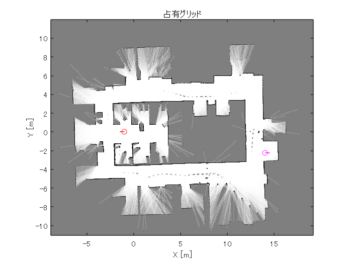
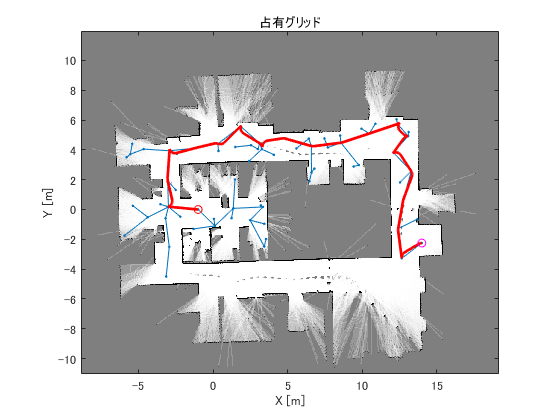
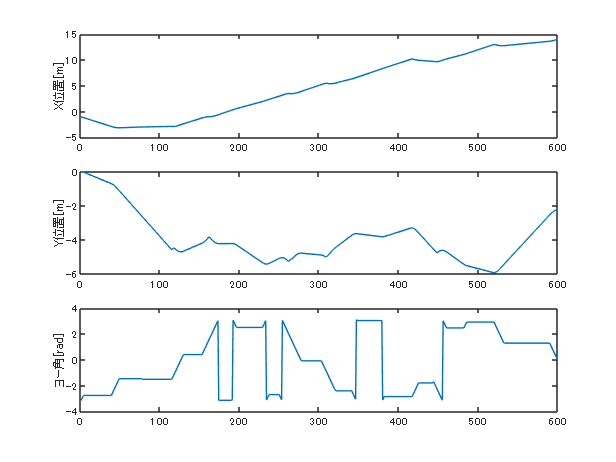
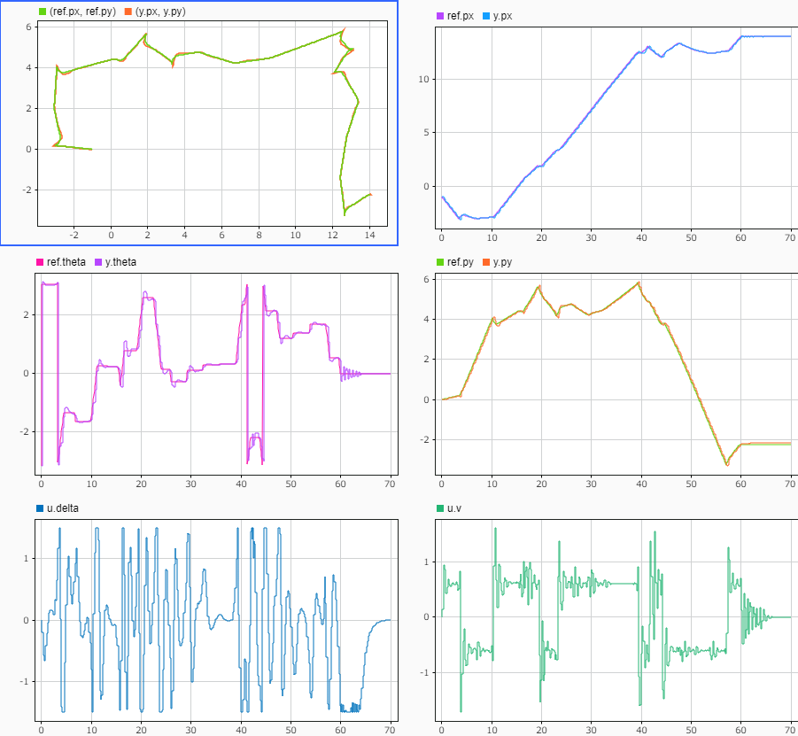

# 非線形MPCコントローラの設計と実装


このサンプルでは、非線形MPCを設計するブロック"Nonlinear MPC Controller"を用いた設計の例を示す。


また、設計後のCコード生成、SILの例も合わせて紹介する。


# 初期化

```matlab:Code
clc; Simulink.sdi.clear; Simulink.sdi.clearPreferences; Simulink.sdi.close;
system_model_name = 'Vehicle_system_Nonlinear_MPC';
controller_model_name = 'Parking_NMPC_Controller';
load_system(system_model_name);
set_param([system_model_name, '/MPC_Controller'], ...
    'ModelName', controller_model_name);
Ts = get_TimeStep('sim_data_vehicle_nl.sldd');
ref_VALIANT = Simulink.Variant;

ref_VALIANT_TS = Simulink.Variant('CTRL_MODE == 1');
ref_VALIANT_TT = Simulink.Variant('CTRL_MODE == 2');

path_Tf = 60;      % パスを走行する時間
```

  
# プラントモデリング


車両のモデルを考える。ここでは、最もシンプルな、x位置、y位置、z方向角度（ヨー角）のみを状態量に持つモデル（Kinematic Bicycle Model）とする。


入力を車両の速度、ステアリング角度、状態をx位置、y位置、ヨー角とすると、状態方程式は以下のようになる。


ただし、は車両のホイールベースである。


上記のモデルでは、ヨー角が360°以上回転する場合、不連続に値が変化する。状態空間モデルとして不連続性が存在することは避けたいため、ヨー角をクオータニオンに置き換えることにする。出力（センサー計測）は、クオータニオンではなく、ヨー角で得られるとする。


クオータニオンはの四つの変数で3次元の回転状態を表現する手法であるが、今回はヨー角のみであるため、の二変数のみで表現する。


上記のヨー角ベースの状態方程式をクオータニオンに置き換えながら、状態空間モデルをSymbolic Math Toolbox™で定式化する。


```matlab:Code
syms wb q0 q3 v delta px py dTime real;

% ステアリング角度と速度からヨー角速度を求める
dtheta = v/wb*tan(delta);
dq0 = cos(dtheta * dTime / 2);
dq3 = sin(dtheta * dTime / 2);

% クオータニオンの角度の更新はクオータニオン積で行う
q0_next = q0 * dq0 - q3 * dq3;
q3_next = q0 * dq3 + q3 * dq0;

% 非線形の離散時間時間状態方程式 x[k+1] = f(x[k]) のfである。
f = [
    px + dTime * v*(2 * q0 ^ 2 - 1);     % 2倍角の公式
    py + dTime * v*(2 * q3 * q0);        % 2倍角の公式
    q0_next;
    q3_next;
    ];

% 非線形の出力方程式
h = [
    px;
    py;
    2 * atan2(q3, q0);
    ];

file_path = [char(proj.RootFolder), filesep, 'gen_script', filesep, 'calc_nonlinear_f.m'];
matlabFunction(f, 'File', file_path);
file_path = [char(proj.RootFolder), filesep, 'gen_script', filesep, 'calc_nonlinear_h.m'];
matlabFunction(h, 'File', file_path);

x = [px; py; q0; q3];
u = [v; delta];
```


Nonlinear MPC Controllerでは、動作点周りの線形化した状態方程式（ヤコビアンモデル）を導出することができれば、それを指定することで計算効率の向上と、動作の安定性を向上させることができる。


今回は導出することができるので、以下のように求める。


```matlab:Code
Ac = jacobian(f, x)
```

Ac = 

   

```matlab:Code
Bc = jacobian(f, u)
```

Bc = 

   

```matlab:Code
file_path = [char(proj.RootFolder), filesep, 'gen_script', filesep, 'calc_Ac.m'];
matlabFunction(Ac, 'File', file_path);
file_path = [char(proj.RootFolder), filesep, 'gen_script', filesep, 'calc_Bc.m'];
matlabFunction(Bc, 'File', file_path);
```


今回の例では、プラントモデルの状態空間モデルと、MPCコントローラ内予測モデルの状態空間モデルの出力変数が異なっている点に注意すること。


プラントモデルではx位置、y位置、ヨー角であるが、予測モデルではx位置、y位置、クオータニオンである。


従って、「Nonlinear MPC Controller」ブロックに入力する前にヨー角からクオータニオンに変換する処理を行っている。「[Parking_NMPC_Controller.slx](Parking_NMPC_Controller)」を参照。


# パスプランニング


今回の例で走行させる経路は、"office_area_gridmap.mat"に保存されている、オフィスの廊下を解析した占有グリッドから生成する。経路は、高次元空間で高速に経路が生成できるRapidly-exploring Random Tree (RRT) を用いて算出する。


RRTについては、本例題のテーマと異なるため、ここでは解説しない。詳細については、「[Plan Mobile Robot Paths using RRT](https://jp.mathworks.com/help/nav/ug/plan-mobile-robot-paths-using-rrt.html)」を参照。


```matlab:Code
start_pos = [-1.0, 0.0, -pi];
goal_pos  = [14, -2.25, 0];
pthObj = plan_MobileRobotPaths_using_RRT(Ts, path_Tf, start_pos, goal_pos);
```








生成された経路をx位置、y位置、ヨー角でそれぞれグラフ化する。


```matlab:Code
figure;
tiledlayout(3, 1);
nexttile;
plot(pthObj.States(:,1));
ylabel('X位置[m]');
nexttile;
plot(pthObj.States(:,2));
ylabel('Y位置[m]');
nexttile;
plot(pthObj.States(:,3));
ylabel('ヨー角[rad]');
```




# MPCの設計


非線形MPCのオブジェクトを構築する。


```matlab:Code
mpcverbosity('off');

% 「nlmpc」コマンドで状態数、出力数、入力数を引数にしてオブジェクトを作成する。
nlMPCObj = nlmpc(4,4,2);

% サンプリング時間、予測、制御ホライズンを設定する。
nlMPCObj.Ts = Ts;
nlMPCObj.PredictionHorizon = 10;
nlMPCObj.ControlHorizon = 10;

% 入力制約を設定する。1番目は速度、2番目はステアリング角度である。
nlMPCObj.MV(1).Min = -2;
nlMPCObj.MV(1).Max = 2;
nlMPCObj.MV(2).Min = -1.5;
nlMPCObj.MV(2).Max = 1.5;

% 重みを設定する。
nlMPCObj.Weights.OutputVariables = [1,1,1,1]; 
nlMPCObj.Weights.ManipulatedVariablesRate = [0.1,0.2];

% パラメータ数を指定する。プラントモデリングのセクションで設計したように、
% サンプリング時間とホイールベースがパラメータとなる。
nlMPCObj.Model.NumberOfParameters = 2;

% 状態方程式、状態方程式のヤコビアン、出力方程式を指定する。
nlMPCObj.Model.StateFcn = "ReedsSheppVehicleStateFcn";
nlMPCObj.Jacobian.StateFcn = "ReedsSheppVehicleStateJacobianFcnRRT";
nlMPCObj.Model.OutputFcn = "ReedsSheppVehicleOutputFcn";

% 状態方程式を離散時間の式として扱う。
nlMPCObj.Model.IsContinuousTime = false;

% 終端条件を指定する。ゴール時には速度とステアリング角度は0になっている必要がある。
nlMPCObj.Optimization.CustomEqConFcn = "parkingTerminalConFcn";
```


ここで、コントローラ（nlmpc）が正しく設定されているかを確認する。


```matlab:Code
% パラメータ
wheel_base = 2.8;

x0 = [start_pos(1); start_pos(2); ...
      cos(start_pos(3) / 2); sin(start_pos(3) / 2)];
u0 = [0; 0];
y0 = start_pos';
params = {wheel_base; Ts};
validateFcns(nlMPCObj,x0,u0,[],params);
```


```text:Output
Model.StateFcn is OK.
Jacobian.StateFcn is OK.
Model.OutputFcn is OK.
Optimization.CustomEqConFcn is OK.
ユーザー指定のモデル、コストおよび制約関数の解析が完了しました。
```


Nonlinear MPCは、現時点では実時間の計算に不向きであり、Simulink実行においても時間がかかる場合が多い。そこで、MEXにコンパイルすることで、シミュレーションの実行時間を改善させることができる。MEX化するには、事前にMEXコンパイラが設定されていなければならない。詳細については、「[Supported and Compatible Compilers](https://jp.mathworks.com/support/requirements/supported-compilers.html)」を参照。


MEX化をしたくない場合は、以下のuse_nlmpc_mexをfalseとすること。


```matlab:Code
use_nlmpc_mex = true;
open_system(controller_model_name);
if (use_nlmpc_mex)
    [coreData,onlineData] = getCodeGenerationData(nlMPCObj,x0,u0,params);
    cd(proj.SimulinkCacheFolder);
    nlMPCObj_mexFcn = buildMEX(nlMPCObj, ...
        "nlMPCObj_mex", coreData, onlineData);
    cd(proj.RootFolder);
    set_param([controller_model_name, '/Nonlinear MPC Controller'], 'UseMEX', 'on');
else
    set_param([controller_model_name, '/Nonlinear MPC Controller'], 'UseMEX', 'off');
end
```


```text:Output
非線形 MPC から MEX 関数 "nlMPCObj_mex" を生成してシミュレーションを高速化します。
コード生成が成功しました。

MEX 関数 "nlMPCObj_mex" は正常に生成されました。
```


```matlab:Code
save_system(controller_model_name);
```


パスプランニングで生成した指令値のヨー角をクオータニオンに変換する。また、指令値の与え方を、毎回のサンプリング時間ごとに、1点で与えるか、予測ホライズン分の長さの参照軌道で与えるか、をここで選択する。


```matlab:Code
nl_ref_signal_MAT = convert_theta_to_q_vec(pthObj.States);

set_slddVal('sim_data_vehicle_nl.sldd', 'NLMPC_Hp', ...
            nlMPCObj.PredictionHorizon);

% CTRL_MODEで指令値パターンを切り替える
%   1のとき1点の指令値
%   2のとき予測ホライズン分の参照軌道指令値
CTRL_MODE = 2;

if (CTRL_MODE == 1)
    set_slddVal('sim_data_vehicle_nl.sldd', 'refNum', ...
        1);
elseif (CTRL_MODE == 2)
    set_slddVal('sim_data_vehicle_nl.sldd', 'refNum', ...
        nlMPCObj.PredictionHorizon);
else
    error('CTRL_MODEの値が正しく設定されていません');
end
```

  
# シミュレーション


シミュレーションを実行し、結果を確認する。


```matlab:Code
open_system(system_model_name);
sim(system_model_name);
plot_vehicle_nl_result_in_SDI;
```


以下のように、参照軌道に沿って走行できていることがわかる。（以下の図の1行1列目のグラフはXYプロットである。）





CTRL_MODEを変更し、1点のみを指定する場合にしてシミュレーションを行い、結果の違いを確認すること。


  
# コード生成


Embedded Coder®によるコード生成結果を確認する。


```matlab:Code
return;
rtwbuild(controller_model_name);
```

  
# SIL検証


SILモードでモデルとコードの等価性を調べる。


```matlab:Code
return;
set_param([system_model_name, '/MPC_Controller'], 'SimulationMode', 'Normal');
sim(system_model_name);
set_param([system_model_name, '/MPC_Controller'], 'SimulationMode', 'Software-in-the-Loop (SIL)');
sim(system_model_name);
```


結果を比較する。


```matlab:Code
compare_previous_run;
```


計算結果は必ずしも一致するわけではない。アルゴリズムの計算は浮動小数点で行われているため、例えば四則演算の計算順序が変わると結果が僅かに異なる場合がある。コード生成前後で四則演算の順序は変わる可能性がある。


