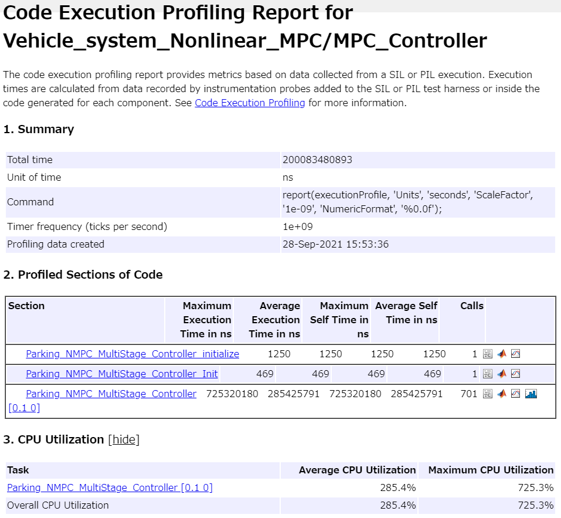
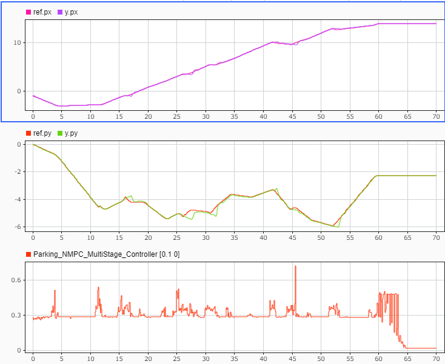

# マルチステージ非線形MPCの設計と実装


このサンプルでは、非線形MPCを設計するブロック"Multistage Nonlinear MPC"を用いた設計の例を示す。


また、設計後のCコード生成、SIL、PILの例も合わせて紹介する。


# 初期化
# プラントモデリング
# パスプランニング


本セクションは「Nonlinear_MPC_design.mlx」と同一であるため、説明は省略する。


```matlab:Code
clc; Simulink.sdi.clear; Simulink.sdi.clearPreferences; Simulink.sdi.close;
system_model_name = 'Vehicle_system_Nonlinear_MPC';
controller_model_name = 'Parking_NMPC_MultiStage_Controller';
load_system(system_model_name);
set_param([system_model_name, '/MPC_Controller'], ...
    'ModelName', controller_model_name);
Ts = get_TimeStep('sim_data_vehicle_nl.sldd');
ref_VALIANT = Simulink.Variant;

ref_VALIANT_TS = Simulink.Variant('CTRL_MODE == 1');
ref_VALIANT_TT = Simulink.Variant('CTRL_MODE == 2');

path_Tf = 60;      % パスを走行する時間

syms wb q0 q3 v delta px py dTime real;

% ステアリング角度と速度からヨー角速度を求める
dtheta = v/wb*tan(delta);
dq0 = cos(dtheta * dTime / 2);
dq3 = sin(dtheta * dTime / 2);

% クオータニオンの角度の更新はクオータニオン積で行う
q0_next = q0 * dq0 - q3 * dq3;
q3_next = q0 * dq3 + q3 * dq0;

% 非線形の連続時間状態方程式。
% ここで、クオータニオンの微分に関しては線形近似を行っている。
% よって、角度が大きく変化する場合は、実際の挙動と異なるので
% 予測ホライズンが長くなりすぎないように注意すること。
f = [
    v*(2 * q0 ^ 2 - 1);     % 2倍角の公式
    v*(2 * q3 * q0);        % 2倍角の公式
    (q0_next - q0) / dTime;
    (q3_next - q3) / dTime;
    ];

% 非線形の出力方程式
h = [
    px;
    py;
    2 * atan2(q3, q0);
    ];

file_path = [char(proj.RootFolder), filesep, 'gen_script', filesep, 'calc_nonlinear_f.m'];
matlabFunction(f, 'File', file_path);
file_path = [char(proj.RootFolder), filesep, 'gen_script', filesep, 'calc_nonlinear_h.m'];
matlabFunction(h, 'File', file_path);

x = [px; py; q0; q3];
u = [v; delta];

Ac = jacobian(f, x);
Bc = jacobian(f, u);
file_path = [char(proj.RootFolder), filesep, 'gen_script', filesep, 'calc_Ac.m'];
matlabFunction(Ac, 'File', file_path);
file_path = [char(proj.RootFolder), filesep, 'gen_script', filesep, 'calc_Bc.m'];
matlabFunction(Bc, 'File', file_path);

start_pos = [-1.0, 0.0, -pi];
goal_pos  = [14, -2.25, 0];
pthObj = plan_MobileRobotPaths_using_RRT(Ts, path_Tf, start_pos, goal_pos);
```

# MPCの設計


マルチステージの非線形MPCのオブジェクトを構築する。


```matlab:Code
mpcverbosity('off');

% 予測ホライズンを指定する。
% マルチステージのMPCでは、制御ホライズンは予測ホライズンと同一となる。
p = 10;

% オブジェクトを作成する。
nlMPCObj = nlmpcMultistage(p, numel(x), numel(u));

% サンプリング時間を設定する。
nlMPCObj.Ts = Ts;

% 入力制約を設定する。1番目は速度、2番目はステアリング角度である。
nlMPCObj.MV(1).Min = -2;
nlMPCObj.MV(1).Max = 2;
nlMPCObj.MV(2).Min = -1.5;
nlMPCObj.MV(2).Max = 1.5;

% パラメータ数を指定する。プラントモデリングのセクションで設計したように、
% サンプリング時間とホイールベースがパラメータとなる。
nlMPCObj.Model.ParameterLength = 2;

% 状態方程式、状態方程式のヤコビアン、出力方程式を指定する。
nlMPCObj.Model.StateFcn = "ReedsSheppVehicleStateFcn_MultiStage";
nlMPCObj.Model.StateJacFcn = "ReedsSheppVehicleStateJacobianFcn_MultiStage";

% コスト関数を設定する。
nlMPCObj.UseMVRate = true;
for ct = 1:p
    nlMPCObj.Stages(ct).CostFcn = "parkingCostFcn";
    nlMPCObj.Stages(ct).CostJacFcn = "parkingCostGradientFcn";
    % ステージパラメータは、xの指令値とx, u, duのそれぞれの重みである。
    nlMPCObj.Stages(ct).ParameterLength = ...
        2 * size(x, 1) + 2 * size(u, 1);
end

% 最適化の重みを設定する。
% この重みはstage.paramとしてSimulinkのブロックへ与えられる。
weight_x = [1, 1, 1, 1];
weight_mv = [0, 0];
weight_dmv = [0.05, 0.05];
```


ここで、最大反復計算回数を指定する。反復回数の上限を指定することで、計算時間を効率化でき、リアルタイム実行のための計算時間の見積もりが可能になる。


```matlab:Code
nlMPCObj.Optimization.UseSuboptimalSolution = true;
nlMPCObj.Optimization.SolverOptions.MaxIterations = 20;
```


ここで、コントローラ（nlmpc）が正しく設定されているかを確認する。


```matlab:Code
% パラメータ
wheel_base = 2.8;

x0 = [start_pos(1); start_pos(2); ...
      cos(start_pos(3) / 2); sin(start_pos(3) / 2)];
u0 = [0; 0];

simdata = getSimulationData(nlMPCObj);
simdata.StateFcnParameter = [wheel_base; Ts];
validateFcns(nlMPCObj, x0, u0, simdata);
```


パスプランニングで生成した指令値のヨー角をクオータニオンに変換する。マルチステージのMPCでは、制御ホライズンは予測ホライズンと同一であるので、参照軌道で与えることにする。


```matlab:Code
nl_ref_signal_MAT = convert_theta_to_q_vec(pthObj.States);
set_slddVal('sim_data_vehicle_nl.sldd', 'NLMPC_Hp', ...
            nlMPCObj.PredictionHorizon);
CTRL_MODE = 2;
set_slddVal('sim_data_vehicle_nl.sldd', 'refNum', ...
    nlMPCObj.PredictionHorizon);
```

  
# シミュレーション


シミュレーションを実行し、結果を確認する。


```matlab:Code
open_system(system_model_name);
sim(system_model_name);
plot_vehicle_nl_result_in_SDI;
```

  
# コード生成


Embedded Coder®によるコード生成結果を確認する。


```matlab:Code
return;
rtwbuild(controller_model_name);
```

  
# SIL検証


SILモードでモデルとコードの等価性を調べる。


```matlab:Code
return;
set_param([system_model_name, '/MPC_Controller'], 'SimulationMode', 'Normal');
sim(system_model_name);
set_param([system_model_name, '/MPC_Controller'], 'SimulationMode', 'Software-in-the-Loop (SIL)');
sim(system_model_name);
```


結果を比較する。


```matlab:Code
compare_previous_run;
```


計算結果は必ずしも一致するわけではない。アルゴリズムの計算は浮動小数点で行われているため、例えば四則演算の計算順序が変わると結果が僅かに異なる場合がある。コード生成前後で四則演算の順序は変わる可能性がある。


  
# PIL検証


マルチステージの非線形MPCの計算時間を測定する。本節では、例としてRaspberry Pi 3 Model B+を用いたPIL検証を行う。性能は以下の通りである。


   -  CPU: 64-bit quad-core ARM Cortex-A53 
   -  Clock: 1.4GHz 
   -  RAM: 1GB 


PIL検証の手順は使用する環境に依存しているため、本節ではコードを用いた説明は行わない。主な作業手順については、「Linear_MPC_Design.mlx」を参照。








1ステップ当たりの平均計算時間は265ms、CPU使用率は265%である。


