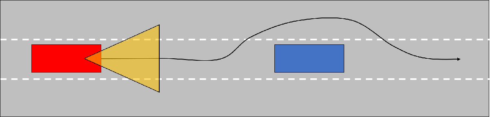
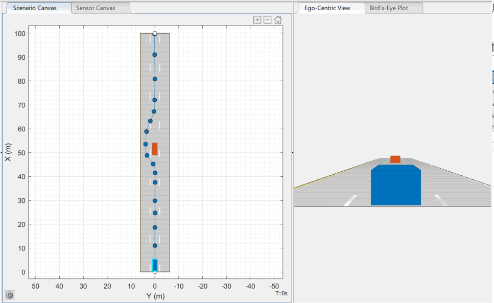

# モデル予測制御ならびにカメラ画像によるターゲット認識を利用した衝突回避
# 背景


本例ではMPC Toolboxから提供されている「[車両の衝突回避の例](https://www.mathworks.com/help/releases/R2021a/mpc/ug/obstacle-avoidance-using-adaptive-model-predictive-control.html)」を題材に、モデル予測制御（MPC）による車両制御の設計を行う。





# 初期化

```matlab:Code
clc; Simulink.sdi.clear; Simulink.sdi.clearPreferences; Simulink.sdi.close;
model_name = 'obstacleAvoidance';
controller_name = 'obstacleAvoid_controller';
Ts = get_TimeStep('obstacleAvoidance_data.sldd');
```

# プラントモデリング


自車の車両モデルは、長方形（５×２[m]）の形状とし、下記の単純な非線形モデルとして想定する。


  


  


状態はの4変数であるが、出力もこの4変数であるとする。


：車両中心におけるグローバルなX座標


：車両中心におけるグローバルなY座標


：車両の方位角（東向きの場合に0、反時計周りを正）


：車両速度


  


入力はの2変数である。


：ステアリング角（反時計周りを正）


：スロットル


  


パラメータは以下である。


：車両の長さ（5[m]）


：スロットルから加速度へ換算する係数（0.5）


  


上記の非線形モデルをノミナル点を基準に線形近似し（下記の線形モデル）、これを基にAdaptive MPC（適応MPC）を構成する。


  


  
# 走行シナリオ


道路シチュエーションとして、３車線の中央を一定速度で走行中の自車前方（X = 50[m], Y = 0[m]）に静止している障害物（他車）があるとする。


自車の車両コントローラー側では、自車のフードに内臓されたカメラセンサーにより前方の障害物を検知し、その結果をもってMPCコントローラーによって障害物の横を走行し、追い越して回避することを狙いとする。


  


本デモでは、Automated Driving Toolboxのドライビングシナリオデザイナーを利用し、運転シナリオを作成し、Simulinkと統合している。


障害物の検知には、Vision Detection Generatorブロックを利用して、シナリオ環境上での障害物を検知し、判別アルゴリズムとともに、Adaptive MPC Controllerに対して衝突回避のための制約条件を与える。





  
# 障害物回避の適応MPCの設計

```matlab:Code
% Assume all the states are measurable. 
% At the nominal operating point, the ego car drives east at a constant speed of 20 meters per second.
V = 20;
x0 = [0; 0; 0; V]; 
u0 = [0; 0];

% Discretize the continuous-time model using the zero-order holder method
% in the |obstacleVehicleModelDT| function.
[Ad,Bd,Cd,Dd,U,Y,X,DX] = obstacleVehicleModelDT(Ts,x0,u0);
dsys = ss(Ad,Bd,Cd,Dd,'Ts',Ts);
dsys.InputName = {'Throttle','Delta'};
dsys.StateName = {'X','Y','Theta','V'};
dsys.OutputName = dsys.StateName;

% Road and Obstacle Information
lanes = 3;
laneWidth = 4;

% In this example, assume that the camera device can detect an obstacle |30|
% meters in front of the vehicle.
DetectionDistance = 30;

```

## ノミナル点におけるMPCを設計

```matlab:Code
% Design a model predictive controller that can make the ego car maintain
% a desired velocity and stay in the middle of the center lane.
status = mpcverbosity('off');
mpcobj = mpc(dsys);
mpcobj.PredictionHorizon = 60;
mpcobj.ControlHorizon = 2;

% To prevent the ego car from accelerating or decelerating too quickly, add
% a hard constraint of 0.2 (m/s^2) on the throttle rate of change.
mpcobj.ManipulatedVariables(1).RateMin = -0.2*Ts; 
mpcobj.ManipulatedVariables(1).RateMax = 0.2*Ts;

% Similarly, add a hard constraint of 15 degrees per second on the steering angle rate of change.
mpcobj.ManipulatedVariables(2).RateMin = -15*pi/180*Ts;
mpcobj.ManipulatedVariables(2).RateMax = 15*pi/180*Ts;

% Scale the throttle and steering angle by their respective operating ranges.
mpcobj.ManipulatedVariables(1).ScaleFactor = 2;
mpcobj.ManipulatedVariables(2).ScaleFactor = 0.2;

% Since there are only two manipulated variables, to achieve zero
% steady-state offset, you can choose only two outputs for perfect
% tracking. In this example, choose the Y position and velocity by setting
% the weights of the other two outputs (X and theta) to zero. Doing so lets
% the values of these other outputs float.
mpcobj.Weights.OutputVariables = [0 30 0 1];

% Update the controller with the nominal operating condition. For a
% discrete-time plant:
%
% * |U = u0|
% * |X = x0|
% * |Y = Cd*x0 + Dd*u0|
% * |DX = Ad*X0 + Bd*u0 - x0|
%
mpcobj.Model.Nominal = struct('U',U,'Y',Y,'X',X,'DX',DX);

% Specify Mixed I/O Constraints for Obstacle Avoidance Maneuver
% When an obstacle is detected, it defines an area on the road (in terms of constraints) that
% the ego car must not enter during the prediction horizon. 
% At the next control interval, the area is redefined based on the new positions of
% the ego car and obstacle until passing is completed.
%
% To define the area to avoid, use the following mixed input/output
% constraints:
%
%   E*u + F*y <= G
% 
% where |u| is the manipulated variable vector and |y| is the output
% variable vector. You can update the constraint matrices |E|, |F|, and |G|
% when the controller is running.

% The first constraint is an upper bound on y (y <= 6 on this three-lane road).
E1 = [0 0];
F1 = [0 1 0 0]; 
G1 = laneWidth*lanes/2;

% The second constraint is a lower bound on y (y >= -6 on this three-lane road).
E2 = [0 0];
F2 = [0 -1 0 0]; 
G2 = laneWidth*lanes/2;

% The third constraint is for obstacle avoidance. Even though no obstacle
% is detected at the nominal operating condition, you must add a "fake"
% constraint here because you cannot change the dimensions of the
% constraint matrices at run time. For the fake constraint, use a
% constraint with the same form as the second constraint.
E3 = [0 0];
F3 = [0 -1 0 0]; 
G3 = laneWidth*lanes/2;

% Specify the mixed input/output constraints in the controller using the
% |setconstraint| function.
setconstraint(mpcobj,[E1;E2;E3],[F1;F2;F3],[G1;G2;G3],[0.1;0.1;0.1]);

% Use a constant reference signal.
refSignal = [0 0 0 V];

```

# シミュレーションで確認


モデルが起動したらSimulinkのツールストリップのシミュレーションタブ＞結果の確認にて鳥観図スコープを起動し、「信号の検索」を行った後、実行ボタンを押下してシミュレーションを開始する。


```matlab:Code
open_system(model_name);
```


結果の波形をシミュレーションデータインスペクターで確認する。


```matlab:Code
sim(model_name);
plot_obstacleAvoid_result_in_SDI;
```


障害物を回避するため、Y方向の位置が指令値から離れていることがわかる。


# コード生成


Embedded Coder®を用いてコントローラをコード生成する。


```matlab:Code
return;
slbuild(controller_name);
```

# SIL検証


SILモードでモデルとコードの等価性を調べる。


```matlab:Code
return;
set_param([model_name, '/Perception & MPC Controller'], 'SimulationMode', 'Normal');
sim(model_name);
set_param([model_name, '/Perception & MPC Controller'], 'SimulationMode', 'Software-in-the-Loop (SIL)');
sim(model_name);
```


結果を比較する。


```matlab:Code
compare_previous_run(1);
```


